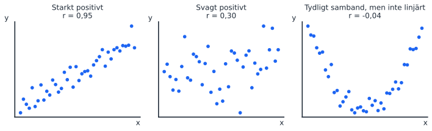

Passet ligger direkt efter F1, som repeterade det viktigaste från STK110. Alla uppgifter är från tidigare tentor i STK120. Sidan är främst till för att gå tillbaka till om frågor om korrelation, kausalitet eller p-värden kommer upp senare i kursen.

::: {.pass-meta}
| Föreläsning | Datum | Tema | Kapitel (5:e uppl.) | Teman enligt kursplanen |
|---|---|---|---|---|
| F1 | fre 2 okt, 08:15–10:00 (samma dag) | Introduktion | 2.4, 3.7, 9.1, 9.3, 10.1 | Fokus repetition. Visualisera samband mellan variabler; hypotestestning; inferens om skillnaden mellan två populationsmedelvärden |
:::

Hypotestest för två populationer (10.1) togs bara upp kort på F1 och förekommer inte på någon av tentorna i STK120, så det ingår inte.

## Körschema

::: {.korschema}
| Tid | Vad | Kommentar |
|---|---|---|
| 10:15–10:20 | Introduktion | Upplägget: räkna själva, paus, genomgång. |
| 10:20–11:10 | Del 1: uppgift 1–7 | Del A (sant/falskt) går snabbt. Lägg tiden på del B. |
| 11:10–11:20 | Paus | |
| 11:20–12:10 | Del 2: genomgång | 2 och 5 tillsammans (korrelation är inte lutning) → 3 (kausalitet) → 6 (p-värde) → 4 och 7 (t och p) → 1. |
| 12:10–12:15 | Sammanfattning | |
:::

## Begrepp att repetera

::: {.nytt}
Kovarians, korrelation och kausalitet

- **Kovarians:** bara tecknet går att tolka. Storleken beror på enheterna.
- **Korrelation r:** riktning och hur tydligt det **linjära** sambandet är, mellan −1 och 1, utan enhet. Inte lutning, inte kausalitet.
- **Kausalitet:** kräver teori och design. Varken korrelation eller regression bevisar den på egen hand.
:::

::: {.tavla}
Rita på tavlan: tre punktmoln

{width=100%}

Rita tre små moln: ett tätt stigande, ett glest stigande och ett U. Fråga: "Vilket har r närmast noll?" Många svarar det glesa, men det är U:et. r mäter bara linjära samband (uppgift 1).
:::

::: {.tavla}
Rita på tavlan: t-fördelningen och p-värdet

{width=85%}

1. Rita en klockkurva och skriv "om H₀ är sann".
2. Markera de kritiska värdena (±2,02 vid df = 42) och skugga svansarna utanför dem: det är α.
3. Rita in observerat t = 2,18 (Antal rum i uppgift 6).
4. Ytan bortom ±2,18 är p-värdet. Mindre yta än α ger förkastad H₀.
5. Visa: större t ger mindre yta, alltså lägre p (uppgift 4).
:::

## Tentafrågor (uppgiftsbladet)

::: {.tenta}
### 1. Korrelation och icke-linjära samband
[2025-03-25, fråga 1]{.chip .datum} [2 p]{.chip} [Sant/falskt]{.chip}

> Korrelationen mäter den linjära samvariationen mellan två variabler. Detta innebär att korrelationen kan beräknas till ett värde nära noll även för samband som är tydliga, men som är icke-linjära.

::: {.callout-tip collapse="true" appearance="simple"}
## Facit och genomgång
**Sant.** U:et i tavelbilden. Därför ska man alltid börja med en scatterplot.
:::
:::

::: {.tenta}
### 2. Vad visar korrelationskoefficienten?
[2024-03-19, fråga 2]{.chip .datum} [2 p]{.chip} [Sant/falskt]{.chip}

> Korrelationskoefficienten för två variabler visar hur stor förändring vi i genomsnitt observerar i den ena variabeln vid en enhets förändring i den andra variabeln.

::: {.callout-tip collapse="true" appearance="simple"}
## Facit och genomgång
**Falskt.** Det beskriver lutningen b₁ (F2). r har ingen enhet. Visa: byter man kronor mot tusental kronor ändras lutningen 1000 gånger, men r är densamma.
:::
:::

::: {.tenta}
### 3. Korrelation, regression och kausalitet
[2024-12-15, fråga 2]{.chip .datum} [2 p]{.chip} [Sant/falskt]{.chip}

> En viktig skillnad mellan korrelationsanalys och regressionsanalys är att regressionsanalysen säger mer om kausalitet, dvs åt vilket håll orsakssambandet går, än vad korrelationsanalysen gör.

::: {.callout-tip collapse="true" appearance="simple"}
## Facit och genomgång
**Falskt.** I en regression **väljer** vi vad som är y och x, men det bevisar ingen riktning. Byter man plats går regressionen lika bra att skatta.
:::
:::

::: {.tenta}
### 4. t-värde och p-värde
[2024-12-15, fråga 1]{.chip .datum} [2 p]{.chip} [Sant/falskt]{.chip}

> Vid hypotestest av en lutningskoefficient kan både t-värden och p-värden användas. Om inget annat ändras innebär ett större t-värde (mer skilt från noll) alltid att p-värdet blir högre.

::: {.callout-tip collapse="true" appearance="simple"}
## Facit och genomgång
**Falskt**, det blir lägre. Samma fråga med "lägre" (2024-11-01, fråga 1) har svaret sant. Läs sista ordet.
:::
:::

::: {.tenta}
### 5. Tolka en korrelationskoefficient
[2025-03-25, fråga 21]{.chip .datum} [2 p]{.chip} [Essä]{.chip}

> Du analyserar löner hos säljare och har följande information: Månadslön: i kronor. Ålder: ålder i antal år. […] Du beräknar att korrelationskoefficienten för variablerna "Ålder" och "Månadslön" är 0,264. Tolka detta värde (2p)

::: {.callout-tip collapse="true" appearance="simple"}
## Facit och genomgång
Positivt (äldre säljare har i genomsnitt högre lön), svagt till måttligt linjärt samband. Det betyder **inte** 0,264 kronor per år, och inte att åldern orsakar lönen (erfarenhet är en trolig alternativ förklaring).
:::
:::

::: {.tenta}
### 6. Hypotestest och p-värde i en Excelutskrift
[2025-06-05, fråga 16.4–6]{.chip .datum} [9 p]{.chip} [Essä]{.chip} [🔁 På varje tenta]{.chip .ofta}

> Du har bestämt dig för att undersöka hur bostadsmarknaden i ett område i Göteborg fungerar och har därför samlat in data (försäljningspris, antal kvadratmeter, antal rum, ifall lägenheten har balkong eller ej, samt månadsavgift) från Hemnet för de lägenheter som såldes där under perioden 1 mars – 15 juni. Du kör sedan en regressionsanalys i Excel.

| | Koefficienter | Standardfel | t-kvot | p-värde |
|---|---|---|---|---|
| Konstant | 2667139,87 | 264205,93 | 10,095 | 8,46E-13 |
| Kvadratmeter | 18110,02 | 5971,18 | 3,033 | 0,0041 |
| Antal rum | 251066,61 | 115386,66 | 2,176 | 0,0352 |
| Avgift | −91,32 | 84,26 | −1,084 | 0,2846 |
| Balkong | −20234,64 | 95628,92 | −0,212 | 0,8334 |

(47 observationer.)

> 4. Tolka p-värdet som rapporteras på raden för "Antal rum" med fokus på statistisk signifikans, dvs tolka det som ett resultat från ett hypotestest. (3 poäng) 5. P-värdet, siffran som rapporteras i outputen, har även en egen tolkning som inte behöver handla om statistisk signifikans. Förklara vad själva p-värdet som rapporteras på raden för "Antal rum" innebär, utan att tolka det som ett test på statistisk signifikans. (3 poäng) 6. Skriv ned de hypoteser som används för att testa den statistiska signifikansen för "avgift". Motivera hypoteserna genom att förklara varför du ställer upp dem exakt som du gör. (3 poäng)

::: {.callout-tip collapse="true" appearance="simple"}
## Facit och genomgång
Säg först: varje rad är ett vanligt hypotestest med H₀: koefficienten är 0 i populationen.

4\. H₀: β = 0, H_A: β ≠ 0. p = 0,0352 < 0,05: förkasta H₀ på 5 % men inte på 1 %. Ange nivån och dra slutsatsen i ord.

5\. Sannolikheten att få en koefficient minst så långt från 0 (|t| ≥ 2,18) **om H₀ är sann**. Inte sannolikheten att H₀ är sann. Den bästa A-tentan skrev "ett högt p-värde kännetecknas av ett stort t-värde", vilket är omvänt.

6\. H₀: β_avgift = 0, H_A: β_avgift ≠ 0. Likheten i H₀, tvåsidigt eftersom ingen riktning är given, β och inte b. Med p = 0,28 förkastas inte H₀, men det bevisar inte att avgiften saknar betydelse.
:::
:::

::: {.tenta}
### 7. Hur hänger t-värde och p-värde ihop?
[2025-08-20, fråga 16.3]{.chip .datum} [4 p]{.chip} [Essä]{.chip}

> Statistisk signifikans för enskilda koefficienter kan redovisas i form av t-värde och/eller p-värde. Förklara vad t-värde respektive p-värde visar och hur de hänger ihop. (4p)

::: {.callout-tip collapse="true" appearance="simple"}
## Facit och genomgång
t = b / se(b): hur många standardfel skattningen ligger från 0. p: sannolikheten för minst så extremt t om H₀ är sann. Större |t| ger lägre p, och |t| > kritiskt t är samma sak som p < α. Kontroll: Antal rum har t = 2,18 och kritiskt t = 2,018 (df = 47 − 4 − 1 = 42), samma slutsats som p = 0,035 < 0,05.
:::
:::

## Interaktivt (visa från datorn)

Dra i r och se hur punktmolnet ändras. Samma data, bara blandade olika mycket.

```{ojs}
//| echo: false
viewof r1 = Inputs.range([-0.99, 0.99], {step: 0.01, value: 0.3, label: "r"})
p1pts = {
  const rand = d3.randomNormal.source(d3.randomLcg(3))(0, 1);
  return d3.range(80).map(() => [rand(), rand()]);
}
p1data = p1pts.map(([z1, z2]) => ({x: z1, y: r1 * z1 + Math.sqrt(1 - r1 * r1) * z2}))
Plot.plot({
  width: 420, height: 420, x: {domain: [-3, 3], label: "x"}, y: {domain: [-3, 3], label: "y"},
  marks: [Plot.dot(p1data, {x: "x", y: "y", fill: "#1c64f2", r: 3.5}), Plot.frame({stroke: "#e5e7eb"})]
})
```
