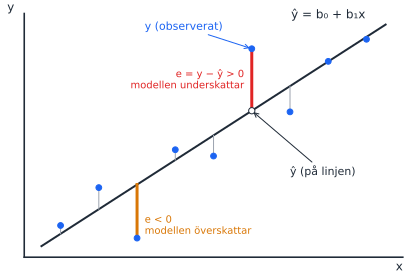
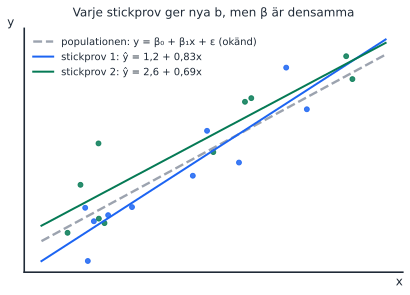
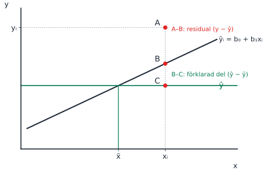

Passet ligger samma dag som F2, så regressionen är helt ny för studenterna. Lägg tid på bilderna innan ni går in på tentafrågorna. Dummyvariabler föreläses först på F3 dagen efter och tas därför i pass 3.

::: {.pass-meta}
| Föreläsning | Datum | Tema | Kapitel (5:e uppl.) | Teman enligt kursplanen |
|---|---|---|---|---|
| F2 | mån 5 okt (samma dag) | Sambandsanalys | 14.1–14.2 | Statistisk signifikans hos en korrelationskoefficient; den enkla linjära regressionsmodellen |
:::

## Körschema

::: {.korschema}
| Tid | Vad | Kommentar |
|---|---|---|
| 14:00–14:10 | Tavelgenomgång: linjen, residualen, β mot b | Bild 1–3 nedan. Kort, studenterna ska räkna själva sedan. |
| 14:10–14:55 | Del 1: studenterna räknar uppgift 1–7 | Uppmuntra formelsamlingen. Gå runt och lyssna efter missförstånd att ta upp efter pausen. |
| 14:55–15:05 | Paus | |
| 15:05–15:50 | Del 2: genomgång | Prioritera i ordning: **6** (notation, begreppsfälla) → **3** (fler variabler) → **4** (kovarians) → **7** (räkna) → 1, 2, 5 snabbt. |
| 15:50–16:00 | Sammanfattning | Tre saker att ta med sig: e = y − ŷ, β är okänd och b är skattad, korrelation är inte lutning. |
:::

Om tiden inte räcker: hoppa över uppgift 1 och 2, de var lätta på tentorna.

## Nya begrepp från F2

### Från korrelation till regressionslinje

::: {.nytt}
Nytt begrepp: regressionslinjen

Korrelationen (pass 1) svarar på *hur tydligt* två variabler hänger ihop. Regressionen svarar på *hur mycket* y ändras när x ändras. Linjen ŷ = b₀ + b₁x har två tal: b₀ är var linjen skär y-axeln och b₁ är lutningen, dvs hur mycket ŷ ökar när x ökar med en enhet.

Säg gärna högt: "korrelationen saknar enhet, lutningen har y:s enhet per x:s enhet". Det är precis det tentafrågan i pass 1 (2024-03-19, fråga 2) testade.
:::

::: {.tavla}
Rita på tavlan: residualen

{width=85%}

1. Rita axlarna och 6–8 punkter som ungefär ligger längs en stigande linje.
2. Dra en linje genom molnet och skriv ŷ = b₀ + b₁x vid den.
3. Välj en punkt ovanför linjen. Markera punkten (y) och stället rakt under på linjen (ŷ).
4. Dra det **lodräta** avståndet mellan dem: det är residualen e = y − ŷ. Positiv, eftersom punkten ligger ovanför.
5. Gör samma sak för en punkt under linjen: negativ residual.
6. Avsluta med: "OLS väljer den linje där summan av alla kvadrerade residualer, SSE, blir så liten som möjligt."
:::

::: {.fraga-gruppen}
Fråga till gruppen innan du visar svaret

"Varför kvadrerar vi residualerna i stället för att bara summera dem?" (Svar: annars tar positiva och negativa residualer ut varandra; summan av OLS-residualerna är alltid noll.)
:::

### Population eller stickprov: β mot b

::: {.nytt}
Nytt begrepp: populationsmodell och skattad modell

Det finns ett sant, okänt samband i populationen, y = β₀ + β₁x + ε. Vi ser bara ett stickprov och räknar fram en skattning, ŷ = b₀ + b₁x. Ett nytt stickprov ger nya b, men β är densamma. Samma tanke som μ och x̄ i förra kursen.
:::

::: {.tavla}
Rita på tavlan: två kolumner

| Populationen (okänd) | Stickprovet (det vi räknar på) |
|---|---|
| β₀, β₁ (grekiska) | b₀, b₁ (latinska) |
| y = β₀ + β₁x + ε | ŷ = b₀ + b₁x |
| ε = felterm | e = y − ŷ = residual |

{width=80%}

Visa att två stickprov ger två olika linjer runt samma streckade sanna linje. Det är därför vi behöver hypotestest för b (pass 3).
:::

::: {.tavla}
Rita på tavlan: tentans A/B/C-figur

{width=80%}

Den här figuren har förekommit på två tentor (2025-03-25, fråga 11 och 2025-08-20, fråga 9). Rita den och fråga: "Vilket avstånd är residualen?" (A–B). Spara B–C till pass 3, där det blir den förklarade delen i R².
:::

### Multipel regression: "allt annat lika"

::: {.nytt}
Nytt begrepp: flera x-variabler

Med flera x tolkas varje b som effekten av just den variabeln **när de andra hålls konstanta**. Därför ändras ofta en koefficient när man lägger till en ny variabel som hänger ihop med den gamla (uppgift 3).

Vardagsexempel: lön och ålder. Ålder ser ut att höja lönen, men en del av det är egentligen erfarenhet. Lägger man till erfarenhet i modellen blir ålderskoefficienten mindre.
:::

### Är korrelationen signifikant?

H₀: ρ = 0 (inget linjärt samband i populationen). Teststatistikan är

$$t = \frac{r\sqrt{n-2}}{\sqrt{1-r^2}}, \qquad df = n - 2.$$

Poäng att lyfta: med stort n blir även ett svagt samband signifikant. Statistisk signifikans är inte samma sak som ett starkt samband.

## Tentafrågor (uppgiftsbladet)

Uppgifterna är desamma som på uppgiftsbladet *#2 Uppgifter* och i *Mentor pass 2*.

::: {.tenta}
### 1. Enkel kontra multipel regression
[2025-06-05, fråga 1]{.chip .datum} [2 p]{.chip} [Sant/falskt]{.chip}

> Skillnaden mellan enkel och multipel regression är att enkel regression endast har en oberoende variabel men multipel regression har minst två oberoende variabler.

::: {.callout-tip collapse="true" appearance="simple"}
## Facit och genomgång
**Sant.** En ren definition, men stanna vid vad den innebär: i multipel regression tolkas varje koefficient "allt annat lika". Bra ingång till uppgift 3.
:::
:::

::: {.tenta}
### 2. Korrelation och konstanta variabler
[2024-11-01, fråga 2]{.chip .datum} [2 p]{.chip} [Sant/falskt]{.chip}

> Korrelationen mäter den linjära samvariationen mellan två variabler. För att kunna beräkna korrelationskoefficienten måste den ena variabeln vara konstant (alltid ha samma värde).

::: {.callout-tip collapse="true" appearance="simple"}
## Facit och genomgång
**Falskt**, och det är tvärtom. r = Cov(x, y) / (sₓ · s_y). Om en variabel är konstant är dess standardavvikelse 0 och vi delar med noll. Båda variablerna måste **variera**.
:::
:::

::: {.tenta}
### 3. Påverkar fler variabler den ursprungliga koefficienten?
[2025-08-20, fråga 1]{.chip .datum} [2 p]{.chip} [Sant/falskt]{.chip}

> Om vi skattat en enkel linjär regressionsmodell och sedan utökar modellen med ytterligare variabler så kommer utökningen av modellen inte att påverka den skattade koefficienten för den ursprungliga oberoende variabeln. Detta eftersom sambandet mellan den oberoende och den beroende variabeln är detsamma oavsett hur många andra variabler som är med i modellen.

::: {.callout-tip collapse="true" appearance="simple"}
## Facit och genomgång
**Falskt.** Koefficienten ändras om den nya variabeln både påverkar y och hänger ihop med den gamla x. Använd lön/ålder/erfarenhet-exemplet ovan.

Gränsfallet: om den nya variabeln är helt okorrelerad med den gamla ändras koefficienten inte. Det är sällsynt i verkliga data.

Koppling framåt: detta heter *omitted variable bias* och återkommer på F12 (pass 5).
:::
:::

::: {.tenta}
### 4. Kovarians kontra korrelation
[2025-08-20, fråga 2]{.chip .datum} [2026-08-20, fråga 2]{.chip .datum} [2 p]{.chip} [Sant/falskt]{.chip} [Ställd två gånger]{.chip .ofta}

> Kovariansen är ett mått på linjärt samband mellan två variabler, som förutom att ange om sambandet är positivt eller negativt även anger hur starkt/tydligt detta samband är.

::: {.callout-tip collapse="true" appearance="simple"}
## Facit och genomgång
**Falskt.** Kovariansens storlek beror på enheterna (kronor eller tusental kronor ger olika tal för samma samband). Bara tecknet går att tolka. Korrelationen standardiserar till [−1, 1] och kan därför tolkas som styrka.

2026-08-20: 69,4 % av maxpoängen, litet gap mellan godkända och underkända.
:::
:::

::: {.tenta}
### 5. Vad är en residual?
[2024-03-19, fråga 1]{.chip .datum} [2 p]{.chip} [Sant/falskt]{.chip}

> Den så kallade "residualen" utgörs av skillnaden mellan det predikterade värdet på den beroende variabeln och det observerade värdet på den beroende variabeln.

::: {.callout-tip collapse="true" appearance="simple"}
## Facit och genomgång
**Sant** (bekräftat mot tentans rättning). Påståendet säger bara "skillnaden mellan" och tar inte ställning till ordningen. När man räknar gäller e = y − ŷ. Peka på residualbilden ovan.
:::
:::

::: {.tenta}
### 6. Population eller stickprov? Notation
[2026-08-20, fråga 9]{.chip .datum} [4 p]{.chip} [Flerval]{.chip} [🔥 Begreppsfälla: 55 %, gap 1,79]{.chip .disc}

> Antag att du skattar en modell som förklarar variation i en beroende variabel med tre oberoende variabler. Till detta används ett stickprov på 1500 observationer. Vilken av nedanstående ekvationer visar korrekt modellen för det verkliga sambandet i populationen?

- ŷ = β₀ + β₁x₁ + β₂x₂ + β₃x₃
- ŷ = b₀ + b₁x₁ + b₂x₂ + b₃x₃
- y = β₀ + β₁x₁ + β₂x₂ + β₃x₃ + ε
- y = b₀ + b₁x₁ + b₂x₂ + e

::: {.callout-tip collapse="true" appearance="simple"}
## Facit och genomgång
**y = β₀ + β₁x₁ + β₂x₂ + β₃x₃ + ε.**

Låt studenterna kontrollera varje alternativ mot tabellen "Populationen / Stickprovet" ovan: grekiska bokstäver, y utan hatt och en felterm ε. Alternativ 1 blandar ŷ med β, alternativ 2 är stickprovets skattade linje och alternativ 4 är en stickprovsmodell som dessutom saknar x₃.

Tvillingfråga: 2025-06-05, fråga 7, frågade efter det **skattade sambandet i stickprovet**. Rätt svar där var ŷ = b₀ + b₁x₁ + b₂x₂ + b₃x₃. Läs alltså noga om frågan gäller populationen eller stickprovet.
:::
:::

::: {.tenta}
### 7. Signifikanstest för korrelationskoefficienten
[Eget räkneexempel]{.chip .egen} [6 p]{.chip}

> En analytiker beräknar korrelationen mellan reklamutgifter och försäljning för n = 25 butiker och får r = 0,42. Testa på 5 % signifikansnivå om det finns ett signifikant linjärt samband i populationen (H₀: ρ = 0, H_A: ρ ≠ 0).

::: {.callout-tip collapse="true" appearance="simple"}
## Facit och genomgång
t = 0,42 · √23 / √(1 − 0,42²) = 2,014 / 0,9075 ≈ **2,22**, df = 23.

Kritiskt värde, tvåsidigt 5 %, df = 23: **2,069**. Eftersom 2,22 > 2,069 förkastas H₀.

Poäng: r² ≈ 0,18, alltså förklaras bara cirka 18 % av variationen. Signifikant men svagt samband.
:::
:::

## Fler tentafrågor på området

::: {.fler}
| Tenta | Fråga | Rätt svar | Använd till |
|---|---|---|---|
| 2025-06-05, fråga 6 | Lutningen skattad till +0,45 i en enkel regression: vilken tolkning är mest korrekt? | "När den oberoende variabeln ökar med 1 enhet ökar den beroende variabeln **i genomsnitt** med 0,45 enheter" | Fallan är "alltid" i stället för "i genomsnitt", och att blanda ihop vilken variabel som ökar. |
| 2025-06-05, fråga 7 | Vilken ekvation motsvarar det skattade sambandet i stickprovet (3 x, n = 2500)? | ŷ = b₀ + b₁x₁ + b₂x₂ + b₃x₃ | Tvilling till uppgift 6. |
| 2025-03-25, fråga 11 | A/B/C-figuren: vilket avstånd är residualen? | A–B | Tavelbilden ovan. |
| 2025-08-20, fråga 9 | Samma figur: vilket avstånd är standardfelet? | Inget, standardfelet är ett sammanfattande mått som inte kan illustreras som ett avstånd | Spara till pass 3. |
| 2025-06-05, fråga 12 | "Om värdet på variabel A helt och perfekt kan förklaras av variabel B säger vi att sambandet är …" | deterministiskt | Kontrast: regression handlar om stokastiska samband, därför finns ε. |
:::

## Interaktivt (visa från datorn)

Dra i reglagen och se hur summan av de kvadrerade residualerna (SSE) ändras. Ingen linje kan få lägre SSE än OLS-linjen.

```{ojs}
//| echo: false
data2 = [
  {x: 1, y: 3.0}, {x: 2, y: 4.2}, {x: 3, y: 2.6}, {x: 4, y: 5.4}, {x: 5, y: 5.2},
  {x: 6, y: 8.6}, {x: 7, y: 6.6}, {x: 8, y: 8.2}, {x: 9, y: 8.9}
]
ols2 = {
  const n = data2.length, mx = d3.mean(data2, d => d.x), my = d3.mean(data2, d => d.y);
  const b1 = d3.sum(data2, d => (d.x - mx) * (d.y - my)) / d3.sum(data2, d => (d.x - mx) ** 2);
  return {b0: my - b1 * mx, b1};
}
viewof b1u = Inputs.range([-0.5, 1.5], {step: 0.01, value: 0.3, label: "lutning b₁"})
viewof b0u = Inputs.range([-2, 8], {step: 0.05, value: 4, label: "intercept b₀"})
viewof visaOls = Inputs.toggle({label: "visa OLS-linjen", value: false})
sseU = d3.sum(data2, d => (d.y - b0u - b1u * d.x) ** 2)
sseO = d3.sum(data2, d => (d.y - ols2.b0 - ols2.b1 * d.x) ** 2)
md`**Din linje:** ŷ = ${b0u.toFixed(2)} + ${b1u.toFixed(2)}x  SSE = **${sseU.toFixed(2)}**  ${visaOls ? `| **OLS:** ŷ = ${ols2.b0.toFixed(2)} + ${ols2.b1.toFixed(2)}x  SSE = **${sseO.toFixed(2)}**` : ""}`
Plot.plot({
  width: 640, height: 360, x: {domain: [0, 10], label: "x"}, y: {domain: [0, 11], label: "y"},
  marks: [
    Plot.ruleX(data2, {x: "x", y1: "y", y2: d => b0u + b1u * d.x, stroke: "#e02424", strokeWidth: 2}),
    Plot.line([[0, b0u], [10, b0u + 10 * b1u]], {stroke: "#1f2a37", strokeWidth: 2.5}),
    visaOls ? Plot.line([[0, ols2.b0], [10, ols2.b0 + 10 * ols2.b1]], {stroke: "#057a55", strokeDasharray: "6,4", strokeWidth: 2}) : null,
    Plot.dot(data2, {x: "x", y: "y", fill: "#1c64f2", r: 5})
  ]
})
```

Signifikanstest för r: ändra r och n och se när H₀ förkastas.

```{ojs}
//| echo: false
viewof rIn = Inputs.range([0, 0.95], {step: 0.01, value: 0.42, label: "r"})
viewof nIn = Inputs.range([5, 200], {step: 1, value: 25, label: "n"})
tKrit = (df) => {  // two-sided 5 % critical t (Cornish-Fisher approximation, good for df ≥ 5)
  const z = 1.959964;
  return z + (z ** 3 + z) / (4 * df) + (5 * z ** 5 + 16 * z ** 3 + 3 * z) / (96 * df ** 2);
}
tObs = rIn * Math.sqrt(nIn - 2) / Math.sqrt(1 - rIn ** 2)
md`t = ${tObs.toFixed(2)}, df = ${nIn - 2}, kritiskt t ≈ ${tKrit(nIn - 2).toFixed(3)} → **${Math.abs(tObs) > tKrit(nIn - 2) ? "förkasta H₀" : "förkasta inte H₀"}**. r² = ${(rIn ** 2 * 100).toFixed(0)} % av variationen.`
```
