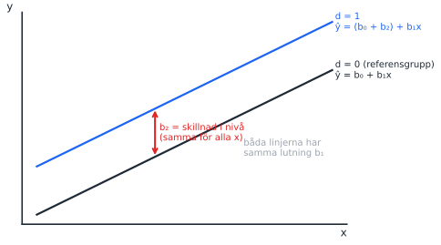
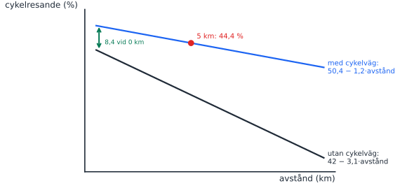
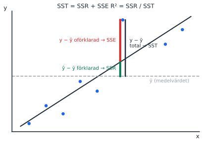
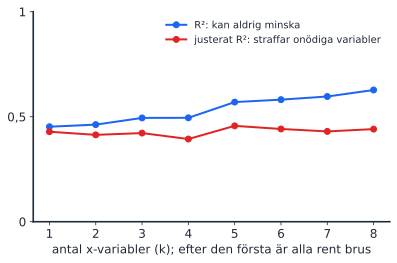
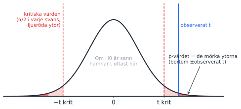

Tre föreläsningar sedan förra passet, så det här är det tyngsta passet. Bygg upp det i samma ordning som föreläsningarna: först vad en dummy gör med linjen, sedan hur bra modellen passar (R²), sist hur vi testar koefficienterna. Excelutskriften (uppgift 2) knyter ihop allt och är den viktigaste tentafrågetypen i kursen.

::: {.pass-meta}
| Föreläsning | Datum | Tema | Kapitel (5:e uppl.) | Teman enligt kursplanen |
|---|---|---|---|---|
| F3 | tis 6 okt | Dummyvariabler | 14.3 + 16.1 | Den multipla linjära regressionsmodellen; kategorisk variabel med flera kategorier |
| F4 | fre 9 okt | Goodness of fit | 14.4 | Hur välanpassad är modellen till data? Fokus R². F-värdet (test av alla parametrar) |
| F5 | tis 13 okt | Signifikanstest | 15.1 | Hypotestester av linjära samband |
:::

## Körschema

Nytt upplägg från och med det här passet: studenterna letar själva upp det de behöver, löser uppgifterna i grupp med roller och leder genomgången. Du går runt, svarar med motfrågor och sammanfattar fällorna. Uppgiftsbladet har roller, en letalista, ledtrådar i två nivåer och slutsvar längst bak.

::: {.korschema}
| Tid | Vad | Du gör |
|---|---|---|
| 13:00–13:05 | Nytt upplägg och förväntningar | Säg [manuset](#inledning) och skriv förväntningarna på tavlan. |
| 13:05–13:20 | Letalistan i par | Gå runt och svara bara med motfrågor. Dela in grupper om 3–4 och dela ut expertuppgifter. |
| 13:20–13:30 | Helgruppskoll av letalistan | Låt grupperna säga vad de hittat ([facit](#letalista)). Rita [dummylinjen](#f3-dummy) eller [SST = SSR + SSE](#f4-fit) bara om något saknas. |
| 13:30–14:05 | Uppgift 1–5 i grupp | Rollerna byts vid varje ny uppgift. Expertgruppen börjar med sin egen uppgift. Frågor du inte svarar på skrivs i parkeringsrutan. |
| 14:05–14:15 | Paus | Kolla vilka uppgifter som behöver mest stöd. |
| 14:15–14:50 | Studentledd genomgång | Expertgrupperna redovisar, cirka 7 min var. Du kompletterar efteråt, särskilt fällorna i **2a** (två olika standardfel) och **4** (svagaste frågan 2026-08-20). |
| 14:50–15:00 | Parkeringsrutan och exit ticket | Andra grupper svarar på frågorna i rutan. Alla skriver en sak de fortfarande är osäkra på på en post-it. |
:::

Blir det ändå tid över: ta en av Excelessäerna under [Fler tentafrågor på området](#fler-tentafragor) som extrauppgift.

## Inledning: nytt upplägg och förväntningar {#inledning}

### Manus (5 min)

Säg det med egna ord. Det viktiga är att du förklarar varför upplägget ändras och vad du förväntar dig.

> "Hittills har jag stått här och förklarat ganska mycket. Det har varit bekvämt för oss alla, men man lär sig mest när man själv letar upp saker, förklarar för någon annan och diskuterar. På tentan sitter ni själva, och då är det de vanorna som hjälper er."
>
> "Därför gör vi lite annorlunda från och med i dag. Ni jobbar i grupper med roller som byts vid varje uppgift: letare, sekreterare, förklarare och skeptiker. Först i bladet finns en letalista. Den gör ni i par och slår upp i formelsamlingen, bilderna och boken. Varje grupp blir expert på en uppgift och redovisar den efter pausen. Det är helt okej att ha fel, vi rättar tillsammans."
>
> "När ni kör fast: fråga tre före mig. Först gruppen, sedan bladet med ledtrådarna längst bak och sedan formelsamlingen, bilderna eller boken. Jag kommer ofta att svara med en motfråga. Det är inte för att vara jobbig, utan för att ni ska hitta det själva och komma ihåg det bättre."
>
> "Det här kommer att kännas ovant och kanske lite långsammare i början. Det är meningen. Vad ni kan förvänta er av mig: jag går runt, lyssnar, hjälper er vidare när ni har kört fast och sammanfattar de vanligaste fällorna i slutet."

::: {.tavla}
Skriv på tavlan och låt det stå kvar

- **Ni:** försöker själva först, bidrar alla, förklarar för varandra, frågar tre före mentorn.
- **Jag:** går runt, ställer frågor tillbaka, hjälper vidare när ni har kört fast, sammanfattar fällorna.
:::

### Grupper och expertuppgifter

- **Grupper:** 3–4 personer. Räkna av så att kompisgäng blandas, men behåll gärna samma grupper hela passet.
- **Expertuppgifter:** uppgift 2 (Excel, begreppsfälla) och uppgift 1 (lång, dela gärna a–c och d–f på två grupper) först. Sedan uppgift 4, och därefter 3 och 5 tillsammans. Är det färre grupper än uppgifter tar du de korta själv i slutet.
- **Redovisningen:** förklararen redovisar, resten av gruppen får fylla i. Fråga sedan gruppen "Håller ni med? Hur vet ni det?" innan du själv lägger till något.

### Motfrågor du kan använda

- "Vad säger formelsamlingen om det?"
- "Vad har ni skrivit i letalistan om det?"
- "Vad tror resten av gruppen?"
- "Har någon annan grupp löst den? Gå och fråga dem."
- "Vilken ledtråd har ni tagit? Ta nästa nivå."
- "Vad skulle hända om …?"

Vänta minst 10 sekunder efter en fråga innan du säger något mer. Tystnaden är när de tänker.

### Parkeringsrutan och exit ticket

- **Parkeringsrutan:** rita en ruta i hörnet av tavlan. Frågor du inte svarar på direkt skrivs där, och i slutet får andra grupper svara.
- **Exit ticket:** ta med post-it-lappar. Alla skriver en sak de fortfarande är osäkra på och lämnar lappen när de går. Det blir underlag för pass 4.

### Facit till letalistan {#letalista}

| Punkt på letalistan | Svar | Används i uppgift |
|---|---|---|
| 1. Dummyvariabel | Antar bara 0 eller 1. Gruppen med 0 är referensgruppen. | 1 |
| 2. Interaktion | y = β₀ + β₁x + β₂d + β₃(d × x) + ε. Sätt in d = 0 och d = 1 och samla termerna. | 1 |
| 3. Tolkning | "När x ökar med en enhet förändras y i genomsnitt med b enheter, allt annat lika." Konstanten är ŷ när alla x = 0. | 1, 2 |
| 4. R² | R² = SSR / SST = 1 − SSE / SST. Total, förklarad och oförklarad variation. | 5 |
| 5. Justerat R² | Vid jämförelse mellan modeller med olika antal variabler. | |
| 6. sₑ | Typiskt avstånd mellan y och ŷ, i y:s enhet. | 2a |
| 7. t-test | t = b / se(b). H₀: β = 0, H_A: β ≠ 0. | 2b, 3, 4 |
| 8. Beslutsregel | Förkasta H₀ om p < α, t.ex. 0,05. | 2b, 3 |
| 9. F-test | H₀: alla β = 0. Förkastas den vet man bara att minst ett β ≠ 0. | 5 |
| 10. Excelutskriften | Två ställen: översta tabellen (sₑ) och koefficienttabellen (se(b)). Se [kartan](#excelkarta). | 2 |

## Nya begrepp

### F3: dummyvariabler {#f3-dummy}

::: {.nytt}
Nytt begrepp: dummyvariabel

En dummy är en variabel som bara kan vara 0 eller 1, t.ex. kvinna = 1, annars 0. Den flyttar hela linjen uppåt eller nedåt för gruppen med 1, men lutningen är densamma. Koefficienten är alltså **skillnaden i genomsnittligt y mellan grupperna**, allt annat lika. Gruppen med 0 kallas **referensgruppen**.

Har variabeln fler kategorier (t.ex. grundskola, gymnasium, universitet) behövs **k − 1** dummies. Tar man med alla k blir de tillsammans exakt lika med konstanten (de summerar alltid till 1) och modellen går inte att skatta: *dummy variable trap*.
:::

::: {.tavla}
Rita på tavlan: dummy som parallell linje

{width=80%}

1. Rita en stigande linje och skriv "d = 0, referensgrupp".
2. Rita en parallell linje ovanför och skriv "d = 1".
3. Pila avståndet mellan linjerna: det är b₂, och det är lika stort vid alla x.
4. Fråga: "Vad skulle krävas för att linjerna inte ska vara parallella?" Det leder till interaktion (uppgift 1).
:::

::: {.tavla}
Rita på tavlan: interaktion (uppgift 1, cykelresande)

{width=80%}

Rita de två linjerna efter att studenterna har räknat c). Poängen: interaktionstermen ändrar **lutningen** för gruppen med cykelväg (−3,1 + 1,9 = −1,2), dummyn ändrar **nivån** (42 + 8,4 = 50,4).
:::

::: {.fraga-gruppen}
Fråga till gruppen

"Vi har tre utbildningsnivåer och kön i en lönemodell. Hur många dummyvariabler behövs?" (Svar: 2 + 1 = 3. Exakt så frågade tentan 2025-08-20, fråga 16.4. Den bästa A-tentan svarade 1.)
:::

### F4: goodness of fit {#f4-fit}

::: {.nytt}
Nytt begrepp: R², justerat R² och standardfelet

- **R²** = SSR / SST: hur stor andel av variationen i y som modellen förklarar.
- **Justerat R²** straffar varje ny variabel. Använd det när modeller med olika antal variabler jämförs.
- **Standardfelet** sₑ (översta tabellen i Excel) = typiskt avstånd mellan observerat och predikterat y, i y:s enhet. Det är *inte* samma sak som standardfelet för en koefficient.
:::

::: {.tavla}
Rita på tavlan: varför SST = SSR + SSE

{width=85%}

1. Rita linjen, en vågrät streckad linje för ȳ och en punkt högt ovanför båda.
2. Dra det lodräta avståndet från ȳ till punkten: totalt (→ SST).
3. Dela det vid regressionslinjen: från ȳ upp till linjen är den förklarade delen (→ SSR), från linjen upp till punkten är residualen (→ SSE).
4. Summera över alla punkter (i kvadrat): SST = SSR + SSE. R² = SSR / SST.
5. Koppla till A/B/C-figuren från pass 2: B–C är förklarat, A–B är residualen.
:::

::: {.tavla}
Rita på tavlan: R² mot justerat R²

{width=75%}

Här läggs rena brusvariabler till en efter en. R² kryper uppåt ändå, medan justerat R² sjunker. Rita det som två skissade kurvor.
:::

### F5: signifikanstest {#f5-test}

::: {.nytt}
Nytt begrepp: t-test och F-test

- **t-test** för en koefficient: H₀: βⱼ = 0. t = bⱼ / se(bⱼ). Svarar på om just den variabeln har ett samband med y, allt annat lika.
- **F-test** (test of joint significance): H₀: β₁ = β₂ = … = βₖ = 0. Svarar på om modellen förklarar något alls. Förkastas H₀ vet vi bara att **minst en** koefficient skiljer sig från noll.
:::

::: {.tavla}
Rita på tavlan: tentans t-test i en bild

{width=80%}

Samma bild som i pass 1, nu med t = b / se(b). Skriv formeln stort och visa hur t växer när b växer och krymper när se växer. Det är hela uppgift 4.
:::

### Karta över Excelutskriften {#excelkarta}

Använd utskriften från uppgift 2 och peka på varje del:

| Var i utskriften | Vad det är | Tentafråga |
|---|---|---|
| Regressionsstatistik: R-kvadrat | Andel förklarad variation (SSR/SST) | 2026-08-20 fr. 12 |
| Justerad R-kvadrat | R² straffat för antal variabler. Använd vid jämförelse mellan modeller | 2025-08-20 fr. 16.2 |
| Standardfel (översta tabellen) | sₑ: typiskt avstånd mellan y och ŷ, i y:s enhet | 2026-08-20 fr. 16a, 2024-12-15 fr. 15.2 |
| ANOVA: F och p-värde för F | Testar om alla β = 0 | 2025-08-20 fr. 16.1 |
| Koefficienter | b: förändring i y per enhet x, allt annat lika | alla tentor |
| Standardfel (per rad) | Osäkerheten i just den koefficienten | 2024-12-15 fr. 15.3 |
| t-kvot | b / se(b) | 2026-08-20 fr. 11 |
| p-värde | Sannolikheten för minst så extremt t om β = 0 | 2025-06-05 fr. 16.4–5 |
| Konstant | ŷ när alla x = 0, ofta utanför data | 2026-08-20 fr. 16c |

## Tentafrågor (uppgiftsbladet)

::: {.tenta}
### 1. Cykelresande och stadsplanering: dummyvariabler och interaktion
[Konstruerad övning]{.chip .egen} [20 p]{.chip} [🔁 Samma upplägg i essäerna]{.chip .ofta}

> En samhällsplanerare vill förklara hur stor andel av sina dagliga resor invånare i en kommun gör med cykel. Hon tror att avstånd till stadskärnan påverkar negativt, men att effekten ser olika ut beroende på om man bor i ett område med cykelvägnät eller inte.
>
> a) Vilka variabler bör ingå i modellen? Motivera. b) Skriv upp modellspecifikationen. Förklara innebörden av varje term. c) Den skattade modellen ger ŷ = 42 − 3,1·avstånd + 8,4·cykelväg + 1,9·(cykelväg × avstånd). Skriv upp de två skattade ekvationerna, en per grupp. d) Tolka koefficienterna i sitt sammanhang. e) En invånare bor 5 km från stadskärnan i ett område med cykelvägnät. Vad är det predikterade cykelresandet? f) Vad är "dummy variable trap" och hur undviker man det?

::: {.callout-tip collapse="true" appearance="simple"}
## Facit och genomgång
a) Avstånd, dummyn cykelväg (1 = cykelvägnät) och interaktionen cykelväg × avstånd. Interaktionen behövs eftersom teorin säger att avståndseffekten **skiljer sig** mellan grupperna.

b) cykelresande = β₀ + β₁·avstånd + β₂·cykelväg + β₃·(cykelväg × avstånd) + ε. β₀: nivå för referensgruppen vid 0 km. β₁: lutning för referensgruppen. β₂: nivåskillnad för gruppen med cykelväg. β₃: skillnad i lutning. ε: felterm.

c) Utan cykelväg: ŷ = 42 − 3,1·avstånd. Med cykelväg: ŷ = 50,4 − 1,2·avstånd.

d) −3,1: utan cykelväg minskar cykelresandet med 3,1 procentenheter per km. 8,4: med cykelväg är nivån 8,4 procentenheter högre vid 0 km. 1,9: avståndseffekten är 1,9 procentenheter svagare per km med cykelväg. Cykelvägar dämpar alltså avståndseffekten.

e) 50,4 − 1,2 · 5 = **44,4 %**.

f) k kategorier ger k − 1 dummies. Annars perfekt multikollinjäritet med konstanten.

Koppling: precis den här typen av tolkning (en dummy, en interaktion, "effekten för respektive grupp") kommer i de engelska essäfrågorna på varje tenta 2024–2025 och i fråga 7 på 2026-08-20.
:::
:::

::: {.tenta}
### 2. Tolka en Excelutskrift
[2026-08-20, fråga 16]{.chip .datum} [8 p]{.chip} [🔥 Begreppsfälla: 33 %, gap 2,33]{.chip .disc} [🔁 På varje tenta]{.chip .ofta}

> Du analyserar ett antal företag för att se vad som kan förklara skillnader i lönsamhet hos ett antal företag. Du använder Excel och får nedanstående resultat från din regressionsanalys. Den beroende variabeln är den årliga lönsamheten (i miljoner kronor) och de oberoende variablerna är: 1. Belopp som läggs på löner (i miljoner kronor) 2. Belopp som läggs på Forskning och Utveckling (FoU) (i miljoner kronor) 3. Belopp som läggs på reklam (i miljoner kronor) 4. Om företaget har en kvinnlig VD (1 om ja, 0 om nej) 5. Andel av de anställda som är kvinnor (procent)

| Regressionsstatistik | |
|---|---|
| Multipel-R | 0,845 |
| R-kvadrat | 0,714 |
| Justerad R-kvadrat | 0,698 |
| Standardfel | 4,321 |
| Observationer | 60 |

| | fg | KvS | MKv | F | p-värde för F |
|---|---|---|---|---|---|
| Regression | 5 | 2890,45 | 578,09 | 30,98 | 0,00001 |
| Residual | 54 | 1008,55 | 18,68 | | |
| Total | 59 | 3899 | | | |

| | Koefficienter | Standardfel | t-kvot | p-värde | Nedre 95% | Övre 95% |
|---|---|---|---|---|---|---|
| Konstant | 25,678 | 8,123 | 3,16 | 0,002 | 9,412 | 41,944 |
| Löner | 0,456 | 0,345 | 1,32 | 0,192 | −0,234 | 1,146 |
| FoU | 1,234 | 0,456 | 2,71 | 0,009 | 0,32 | 2,148 |
| Reklam | 0,789 | 0,345 | 2,29 | 0,026 | 0,097 | 1,481 |
| Kvinnlig VD | 3,567 | 1,234 | 2,89 | 0,005 | 1,091 | 6,043 |
| Andel kvinnor | 0,123 | 0,056 | 2,2 | 0,032 | 0,011 | 0,235 |

> a) Tolka värdet på "Standardfel" i översta delen av tabellen noga (2 poäng) b) Tolka den skattade koefficienten för variabeln FoU, inklusive dess statistiska signifikans (4p) c) Förklara **med en mening** varför vi ska vara försiktiga när vi tolkar den skattade koefficienten för konstanten i ovanstående tabell (2p)

::: {.callout-tip collapse="true" appearance="simple"}
## Facit och genomgång
a) 4,321 är sₑ: företagens faktiska lönsamhet avviker i genomsnitt ungefär 4,3 miljoner kronor från den predikterade. **Fallan:** att tolka det som FoU:s eller någon annan koefficients standardfel. Den bästa A-tentan blandade också ihop det med t-värdet.

b) Ytterligare 1 miljon kronor på FoU hänger i genomsnitt ihop med 1,234 miljoner kronor högre lönsamhet, **allt annat lika**. t = 1,234 / 0,456 ≈ 2,71, p = 0,009 < 0,05 (även < 0,01): signifikant på 5 % och 1 %. Nämn hypoteserna H₀: β_FoU = 0 mot H_A: β_FoU ≠ 0.

c) Konstanten är predikterad lönsamhet för ett företag utan löner, FoU, reklam, kvinnlig VD och kvinnliga anställda, något som inte finns i data (extrapolation).

Genomgångstips: låt studenterna själva hitta varje siffra i tabellen med "kartan" ovan innan du visar svaret.
:::
:::

::: {.tenta}
### 3. t-värde och p-värde
[2024-11-01, fråga 1]{.chip .datum} [2 p]{.chip} [Sant/falskt]{.chip}

> Vid hypotestest av en lutningskoefficient kan både t-värden och p-värden användas. Om inget annat ändras innebär ett större t-värde (mer skilt från noll) alltid att p-värdet blir lägre.

::: {.callout-tip collapse="true" appearance="simple"}
## Facit och genomgång
**Sant.** Större |t| ger mindre yta i svansarna, alltså lägre p. Den bästa A-tentan svarade fel här. Systerfrågan 2024-12-15 hade ordet "högre" och då var svaret falskt (pass 1).
:::
:::

::: {.tenta}
### 4. Koefficient, standardfel och t-värde
[2026-08-20, fråga 11]{.chip .datum} [2025-03-25, fråga 12]{.chip .datum} [4 p]{.chip} [⚠️ Svagast på tentan: 33 %, gap 0,83]{.chip .svar}

> Antag att du genomför ett test för individuell signifikans, dvs testar signifikansen för en enskild koefficient. Om den skattade koefficienten är positiv, vilket av följande påståenden är korrekt?

- Ett högre värde på koefficienten leder till ett högre värde på t-värdet, allt annat lika
- Ett högre värde på koefficienten leder till ett högre värde på standardfelet, allt annat lika
- Koefficientens och t-värdets värden är oberoende av varandra
- Ett högre värde på standardfelet leder till ett högre värde på t-värdet, allt annat lika

::: {.callout-tip collapse="true" appearance="simple"}
## Facit och genomgång
**Ett högre värde på koefficienten leder till ett högre värde på t-värdet, allt annat lika.**

Allt följer ur t = b / se(b). Skriv formeln på tavlan och låt studenterna testa varje alternativ mot den i stället för att resonera fritt. Exempel ur uppgift 2: FoU, 1,234 / 0,456 ≈ 2,71.

Frågan kom ordagrant även 2025-03-25: den återkommer.
:::
:::

::: {.tenta}
### 5. F-test och R²
[2026-08-20, fråga 1]{.chip .datum} [2 p]{.chip} [Sant/falskt]{.chip} [Lätt: 90 %]{.chip .latt}

> En modell som har ett lågt p-värde för F-testet och alltså är statistiskt signifikant som helhet, kan ändå ha ett lågt värde på determinationskoefficienten.

::: {.callout-tip collapse="true" appearance="simple"}
## Facit och genomgång
**Sant.** F-testet frågar *om* modellen förklarar något, R² *hur mycket*. Med många observationer räcker lite förklaring för signifikans. Exempel: LPM-uppgiften i pass 5 har R² = 0,13 men F-testets p-värde 0,0000.
:::
:::

## Fler tentafrågor på området {#fler-tentafragor}

::: {.fler}
| Tenta | Fråga | Rätt svar | Kommentar |
|---|---|---|---|
| 2024-03-19, fråga 11 | "Värdet på den skattade koefficienten för en dummyvariabel visar:" | den genomsnittliga skillnaden i intercept mellan de två grupperna | Tavelbilden med parallella linjer. |
| 2024-11-01, fråga 10 | "En så kallad dummyvariabel:" | är en variabel som bara kan anta två olika värden | |
| 2025-08-20, fråga 16.4 | Lönemodell med ålder, utbildningsnivå (3 nivåer), erfarenhet och kön: hur många dummyvariabler? | 3 (2 för utbildning, 1 för kön) | Bästa A-tentan svarade 1. Bra diskussionsfråga. |
| 2024-12-15, fråga 11 | "I en regressionsmodell mäter determinationskoefficienten …" | hur stor andel av variationen i den beroende variabeln som förklaras av modellen | |
| 2026-08-20, fråga 12 | Vad representerar R² i en enkel linjär regression? | den procentuella andelen av den totala variationen i den beroende variabeln som förklaras av de oberoende variablerna | 82 % av maxpoängen. Distraktorn byter plats på beroende och oberoende. |
| 2024-12-15, fråga 12 | Koefficienten för "bostadsyta" betecknas …? | β₁ (inte x₁) | Notation, som i pass 2. |
| 2025-08-20, fråga 9 | A/B/C-figuren: vilket avstånd är standardfelet? | Inget, det är ett sammanfattande mått | Koppla till "Standardfel" i kartan. |
| 2024-03-19, fråga 15; 2024-12-15, fråga 15; 2025-08-20, fråga 16 | Excelessäer: tolka F-test, R², koefficienter, hypoteser | | Samma färdigheter som uppgift 2. Bra extrauppgifter. |
:::

Gemensamt F-test som sant/falskt (2025-06-05 fråga 2 och 2025-03-25 fråga 2) ligger på uppgiftsbladet för pass 4.

## Interaktivt (visa från datorn)

Dummy och interaktion: ändra koefficienterna och se hur de två gruppernas linjer rör sig.

```{ojs}
//| echo: false
viewof c_b1 = Inputs.range([-5, 1], {step: 0.1, value: -3.1, label: "b₁ avstånd"})
viewof c_b2 = Inputs.range([-10, 20], {step: 0.1, value: 8.4, label: "b₂ cykelväg (dummy)"})
viewof c_b3 = Inputs.range([-3, 4], {step: 0.1, value: 1.9, label: "b₃ interaktion"})
md`Utan cykelväg: ŷ = 42 ${c_b1 < 0 ? "−" : "+"} ${Math.abs(c_b1).toFixed(1)}·avstånd  |  Med cykelväg: ŷ = ${(42 + c_b2).toFixed(1)} ${(c_b1 + c_b3) < 0 ? "−" : "+"} ${Math.abs(c_b1 + c_b3).toFixed(1)}·avstånd`
Plot.plot({
  width: 640, height: 340, x: {domain: [0, 12], label: "avstånd (km)"}, y: {domain: [0, 70], label: "cykelresande (%)"},
  color: {legend: true, domain: ["utan cykelväg", "med cykelväg"], range: ["#1f2a37", "#1c64f2"]},
  marks: [
    Plot.line([[0, 42], [12, 42 + 12 * c_b1]], {stroke: "#1f2a37", strokeWidth: 2.5}),
    Plot.line([[0, 42 + c_b2], [12, 42 + c_b2 + 12 * (c_b1 + c_b3)]], {stroke: "#1c64f2", strokeWidth: 2.5}),
    Plot.ruleY([0])
  ]
})
```

R² mot justerat R²: lägg till brusvariabler och se vad som händer.

```{ojs}
//| echo: false
viewof k_brus = Inputs.range([0, 15], {step: 1, value: 0, label: "antal brusvariabler"})
r2demo = {
  // fixed simulated data: y depends on x1 only, n = 25
  const n = 25, rand = d3.randomNormal.source(d3.randomLcg(42))(0, 1);
  const x1 = d3.range(n).map(() => rand());
  const y = x1.map(v => 1 + 1.2 * v + rand());
  const noise = d3.range(15).map(() => d3.range(n).map(() => rand()));
  const fit = (k) => {
    const cols = [x1, ...noise.slice(0, k)];
    const X = d3.range(n).map(i => [1, ...cols.map(c => c[i])]);
    const p = X[0].length;
    const XtX = d3.range(p).map(a => d3.range(p).map(b => d3.sum(X, r => r[a] * r[b])));
    const Xty = d3.range(p).map(a => d3.sum(X, (r, i) => r[a] * y[i]));
    const A = XtX.map((r, i) => [...r, Xty[i]]);
    for (let i = 0; i < p; i++) {
      let m = i; for (let j = i + 1; j < p; j++) if (Math.abs(A[j][i]) > Math.abs(A[m][i])) m = j;
      [A[i], A[m]] = [A[m], A[i]];
      for (let j = i + 1; j < p; j++) { const f = A[j][i] / A[i][i]; for (let c = i; c <= p; c++) A[j][c] -= f * A[i][c]; }
    }
    const beta = Array(p).fill(0);
    for (let i = p - 1; i >= 0; i--) beta[i] = (A[i][p] - d3.sum(d3.range(i + 1, p), c => A[i][c] * beta[c])) / A[i][i];
    const yh = X.map(r => d3.sum(r, (v, j) => v * beta[j]));
    const my = d3.mean(y), sst = d3.sum(y, v => (v - my) ** 2), sse = d3.sum(y, (v, i) => (v - yh[i]) ** 2);
    const r2 = 1 - sse / sst, kk = k + 1;
    return {k: kk, r2, adj: 1 - (1 - r2) * (n - 1) / (n - kk - 1)};
  };
  return d3.range(0, 16).map(fit);
}
md`Med ${k_brus} brusvariabler: R² = **${r2demo[k_brus].r2.toFixed(3)}**, justerat R² = **${r2demo[k_brus].adj.toFixed(3)}**`
Plot.plot({
  width: 640, height: 300, y: {domain: [-0.2, 1], label: "värde"}, x: {label: "antal brusvariabler"},
  marks: [
    Plot.line(r2demo.map((d, i) => ({i, v: d.r2})), {x: "i", y: "v", stroke: "#1c64f2", strokeWidth: 2}),
    Plot.line(r2demo.map((d, i) => ({i, v: d.adj})), {x: "i", y: "v", stroke: "#e02424", strokeWidth: 2}),
    Plot.ruleX([k_brus], {stroke: "#9ca3af", strokeDasharray: "4,4"}),
    Plot.text([{i: 13, v: 0.95, t: "R² (blå)"}, {i: 13, v: 0.85, t: "justerat R² (röd)"}], {x: "i", y: "v", text: "t"})
  ]
})
```
