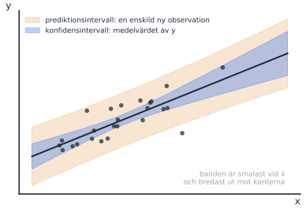
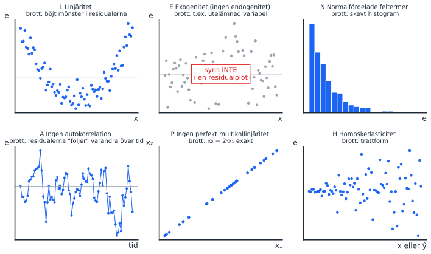
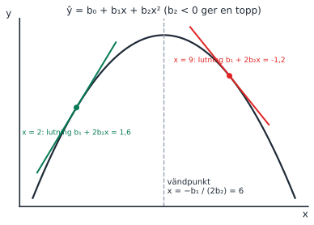

Tre områden som alla återkommer på nästan varje tenta: restriktionstestet med bostadsrätterna, antagandena och den kvadratiska modellens marginaleffekt. Antagandena var en av de tydligaste begreppsfällorna 2026-08-20, så lägg mest tid där. F9 (logaritmer) hålls på förmiddagen samma dag men tas i pass 5.

::: {.pass-meta}
| Föreläsning | Datum | Tema | Kapitel (5:e uppl.) | Teman enligt kursplanen |
|---|---|---|---|---|
| F6 | tors 15 okt | Begränsade modeller | 15.2–15.3 | Ett generellt test av linjära restriktioner; intervalluppskattningar för responsvariabeln |
| F7 | fre 16 okt | Antaganden i modeller | 15.4 | Modellantaganden och vanliga överträdelser |
| F8 | mån 19 okt | Modeller med polynom | 16.3 | Den kvadratiska regressionsmodellen |
:::

## Körschema

::: {.korschema}
| Tid | Vad | Kommentar |
|---|---|---|
| 13:00–13:25 | Inledning: det här behöver ni för uppgifterna | Se nästa avsnitt. Repetition (5 min), verktygslådan (5 min), sedan bilderna för LENA PH, restriktionen och parabeln (15 min). Formelbladet står först på uppgiftsbladet. |
| 13:25–14:05 | Del 1: uppgift 1–5 | Uppgift 1 utan anteckningar först, sedan med. Hänvisa till formelbladet och tipsraderna innan du förklarar själv. |
| 14:05–14:15 | Paus | |
| 14:15–14:55 | Del 2: genomgång | **1** (antaganden, begreppsfälla) → **3** och **5** (kvadratisk, med tavelbilden) → **2** (restriktion) → 4. |
| 14:55–15:00 | Sammanfattning | LENA PH en gång till, och formeln b₁ + 2b₂x. |
:::

Blir det ändå tid över: ta en av frågorna under [Fler tentafrågor på området](#fler-tentafragor), t.ex. den begränsade modellen eller KI mot PI.

## Inledning: det här behöver ni för uppgifterna {#inledning}

Studenterna har ett formelblad först på uppgiftsbladet och en tipsrad under varje uppgift. Inledningen ska få dem att använda bladet, så att du slipper förklara samma sak för varje grupp.

### Steg 1: repetition från pass 3 (5 min)

::: {.fraga-gruppen}
Fråga till gruppen, en i taget

1. "Vad testar F-testet i Excelutskriften, och vad vet vi om H₀ förkastas?" (Svar: H₀: alla β = 0. Förkastas den vet vi bara att **minst ett** β är skilt från 0. Det är hela uppgift 4.)
2. "Vad är SSE?" (Svar: summan av de kvadrerade residualerna, den oförklarade variationen. Restriktionstestet jämför SSE från två modeller.)
3. "Vad betyder lutningen b₁ i ŷ = b₀ + b₁x?" (Svar: hur mycket ŷ ändras när x ökar med en enhet. Följdfråga: "Är lutningen densamma överallt på en parabel?" Det leder till marginaleffekten.)
:::

### Steg 2: verktygslådan (5 min)

::: {.tavla}
Skriv upp listan i ett hörn av tavlan och låt den stå kvar hela passet

1. **Restriktion:** skriv påståendet som en likhet mellan β:n. Likheten står i H₀.
2. **Begränsad modell:** sätt in H₀ i modellen. Jämför SSE med partiellt F: F = ((SSE_R − SSE_U) / q) / (SSE_U / (n − k − 1)).
3. **KI mot PI:** samma mittpunkt ŷ. PI är alltid bredare.
4. **LENA PH:** linjäritet (i parametrarna), exogenitet, normalfördelad felterm, ingen autokorrelation, ingen perfekt multikollinjäritet, homoskedasticitet.
5. **Kvadratisk modell:** marginaleffekt = b₁ + 2b₂x, vändpunkt x = −b₁ / (2b₂).
6. **ln y:** en förändring på 0,01 i ln y är ungefär 1 % i y.
:::

### Steg 3: vilket verktyg behövs i vilken uppgift?

| Uppgift | Verktyg (från listan) | Det ni ska kunna göra | Tavelbild |
|---|---|---|---|
| 1. Antaganden (12 p) | 4 | Para ihop antagande och beskrivning, och känna igen de tre beskrivningarna som är fel | [LENA PH](#f7-lena) |
| 2. Lika lutning (4 p) | 1 | Översätta "samma lutning" till H₀ och H_A | [Restriktionstest](#f6-restriktion) |
| 3. Kvadratisk, räkna (4 p) | 5, 6 | Sätta in i b₁ + 2b₂x och tolka svaret i procent eftersom y är logaritmerad | [Parabeln med tangenter](#f8-polynom) |
| 4. Gemensamt F-test | 2 (pass 3) | Säga vad H₀ är och vad det betyder att förkasta den | Ingen ny bild |
| 5. Kvadratisk, begrepp (2 p) | 5 | Förklara varför x² inte kan hållas konstant | [Parabeln med tangenter](#f8-polynom) |

::: {.fraga-gruppen}
Avsluta inledningen med en kontrollfråga

"Gäller antagandet om linjäritet *variablerna* eller *parametrarna*?" Låt dem gissa, men säg inte svaret än. Det är begreppsfällan i uppgift 1 och ni tar den i genomgången.
:::

## Nya begrepp

### F6: begränsade modeller och intervall {#f6-restriktion}

::: {.nytt}
Nytt begrepp: restriktionstest (partiellt F-test)

Vi vill testa något annat än "är koefficienten noll", t.ex. **har två variabler samma lutning?** Gör så här:

1. Skriv H₀ som en likhet: β₃ = β₄.
2. Bygg den **begränsade** modellen genom att sätta in H₀: y = β₀ + β₁x₁ + β₂x₂ + β₃(x₃ + x₄) + ε.
3. Skatta både den obegränsade och den begränsade modellen och jämför deras SSE:

$$F = \frac{(SSE_R - SSE_U)/q}{SSE_U/(n-k-1)}$$

q = antal restriktioner (här 1). Om F är stort ökar felet mycket när restriktionen tvingas på, och då förkastas H₀. Den begränsade modellen kan aldrig ha mindre SSE än den obegränsade.
:::

::: {.nytt}
Nytt begrepp: konfidensintervall mot prediktionsintervall

- **Konfidensintervall:** för **medelvärdet** av y vid givna x, t.ex. genomsnittspriset för alla hus på 100 kvm.
- **Prediktionsintervall:** för **ett enskilt** nytt y, t.ex. priset på ett visst hus. Alltid **bredare**, eftersom det också innehåller slumpen i ε.
- Båda har **samma mittpunkt**: punktskattningen ŷ.
:::

::: {.tavla}
Rita på tavlan: två band runt samma linje

{width=80%}

Rita linjen, ett smalt band (KI) och ett brett band (PI) runt samma linje. Fråga: "Vilket intervall skulle du använda om du ska sälja **din** lägenhet?" (PI.)
:::

### F7: antaganden (LENA PH) {#f7-lena}

::: {.nytt}
Minnesregel: LENA PH

| | Antagande | Brott | Vad händer? |
|---|---|---|---|
| **L** | Linjäritet i parametrarna, rätt specificerad modell | Böjt mönster i residualerna | Fel modell; lös med x², ln x |
| **E** | Exogenitet: feltermen är inte korrelerad med något x | Utelämnad variabel, omvänd kausalitet | **Skeva** koefficienter (värst) |
| **N** | Normalfördelade feltermer | Skevt residualhistogram | t- och F-test osäkra i små stickprov |
| **A** | Ingen autokorrelation | Residualerna följer varandra över tid | För små standardfel |
| **P** | Ingen **perfekt** multikollinjäritet | x₂ = 2·x₁ exakt | Går inte att skatta |
| **H** | Homoskedasticitet: samma varians för alla x | Trattform | Standardfel och test opålitliga |
:::

::: {.tavla}
Rita på tavlan: sex små residualplottar

{width=100%}

Rita en ruta per bokstav och låt gruppen gissa bokstaven innan du skriver den. Poängen med E: brottet **syns inte** i en residualplot, det måste resoneras fram.
:::

::: {.fraga-gruppen}
Fråga till gruppen

"Är det ett brott mot antagandena att vi har x² i modellen?" (Nej. Linjäriteten gäller **parametrarna**, inte variablerna. Det är exakt den distraktor som lurade studenter 2026-08-20.)
:::

### F8: modeller med polynom {#f8-polynom}

::: {.nytt}
Nytt begrepp: marginaleffekt i en kvadratisk modell

I ŷ = b₀ + b₁x + b₂x² finns x på två ställen, så effekten av en enhet mer x beror på var man är:

$$\text{marginaleffekt} = b_1 + 2b_2x, \qquad \text{vändpunkt: } x = -\frac{b_1}{2b_2}.$$

b₂ < 0 ger en topp (avtagande avkastning), b₂ > 0 en dal. x² kan inte "hållas konstant" medan x ändras.
:::

::: {.tavla}
Rita på tavlan: parabeln med tangenter

{width=80%}

1. Rita en upp-och-nervänd parabel.
2. Rita en brant tangent till vänster (positiv marginaleffekt) och en negativ till höger.
3. Markera toppen och skriv x = −b₁ / (2b₂).
4. Räkna med siffrorna: b₁ = 2,4 och b₂ = −0,2 ger 2,4 + 2(−0,2)·2 = 1,6 vid x = 2 och 2,4 + 2(−0,2)·9 = −1,2 vid x = 9.
:::

## Tentafrågor (uppgiftsbladet)

::: {.tenta}
### 1. Matcha regressionsantaganden
[2026-08-20, fråga 15]{.chip .datum} [12 p]{.chip} [🔥 Begreppsfälla: 42 %, gap 2,07]{.chip .disc} [🔁 På varje tenta]{.chip .ofta}

> Inom regressionsanalysen använder vi ett antal antaganden. Para ihop nedanstående beskrivningar med de olika antagandena.

Antaganden: linjäritet, ingen multikollinjäritet, homoskedasticitet, ingen autokorrelation, ingen endogenitet, normalfördelning.

Beskrivningar att välja bland:

- sambandet är linjärt i modellens parametrar och modellen är korrekt specificerad
- de oberoende variablerna har inte ett perfekt linjärt samband
- feltermens varians är densamma för alla värden på de oberoende variablerna
- feltermerna från olika observationer är inte korrelerade med varandra
- feltermen är inte korrelerad med någon av de oberoende variablerna
- feltermerna är symmetriskt normalfördelade kring noll
- alla variabler i modellen måste vara uttryckta i linjär form och får inte exempelvis kvadreras eller logaritmeras
- den beroende variabeln måste vara normalfördelad för att konfidensintervall och hypotestest ska vara giltiga
- korrelationen mellan de oberoende variablerna måste vara exakt noll

::: {.callout-tip collapse="true" appearance="simple"}
## Facit och genomgång
Gå igenom i LENA PH-ordning:

- **Linjäritet** → sambandet är linjärt i modellens parametrar och modellen är korrekt specificerad
- **Exogenitet (ingen endogenitet)** → feltermen är inte korrelerad med någon av de oberoende variablerna
- **Normalfördelning** → feltermerna är symmetriskt normalfördelade kring noll
- **Ingen autokorrelation** → feltermerna från olika observationer är inte korrelerade med varandra
- **Ingen (perfekt) multikollinjäritet** → de oberoende variablerna har inte ett perfekt linjärt samband
- **Homoskedasticitet** → feltermens varians är densamma för alla värden på de oberoende variablerna

De tre distraktorerna är precis de missförstånd som kostade poäng. Även den bästa A-tentan föll på två av dem:

- "får inte kvadreras eller logaritmeras": fel, det motsäger hela pass 4 och 5. A-tentan valde den för linjäritet.
- "korrelationen … måste vara exakt noll": fel, kravet är *inte perfekt*. A-tentan valde den för autokorrelation.
- "den beroende variabeln måste vara normalfördelad": fel, det är **feltermen**.
:::
:::

::: {.tenta}
### 2. Hypoteser för lika lutningskoefficienter
[2026-08-20, fråga 10]{.chip .datum} [4 p]{.chip} [Lätt: 88 %]{.chip .latt} [🔁 På nästan varje tenta]{.chip .ofta}

> Antag att du vill skatta sambandet mellan pris på bostadsrättslägenheter och ett antal oberoende variabler. Du skattar därför följande modell y = β₀ + β₁x₁ + β₂x₂ + β₃x₃ + β₄x₄ + ε där de oberoende variablerna är x₁ = bostadsyta, x₂ = antal rum, x₃ = bostadsrättsföreningens ålder och x₄ = byggnadens ålder. Om du vill undersöka om bostadsrättsföreningens ålder och byggnadens ålder har samma lutningskoefficienten, vilken av nedanstående visar då de hypoteser som ska testas?

- H₀: β₃ + β₄ = 1, H_A: β₃ + β₄ ≠ 1
- H₀: β₃ = β₄ = 0, H_A: β₃ ≠ β₄ ≠ 0
- H₀: β₃ = β₄, H_A: β₃ ≠ β₄
- H₀: β₃ + β₄ = 0, H_A: β₃ + β₄ ≠ 0

::: {.callout-tip collapse="true" appearance="simple"}
## Facit och genomgång
**H₀: β₃ = β₄, H_A: β₃ ≠ β₄.** "Samma lutning" översätts ordagrant, och likheten står i H₀.

Ta sedan steget till den begränsade modellen, eftersom det är så frågan oftast ställs: y = β₀ + β₁x₁ + β₂x₂ + β₃(x₃ + x₄) + ε (2024-03-19, fråga 10). På 2025-03-25 och 2025-08-20 gällde frågan i stället bostadsyta och antal rum. Då blir den begränsade modellen y = β₀ + β₁(x₁ + x₂) + β₃x₃ + β₄x₄ + ε.
:::
:::

::: {.tenta}
### 3. Marginaleffekt i en kvadratisk modell (räkna)
[2026-08-20, fråga 6]{.chip .datum} [4 p]{.chip} [74 %, gap 1,39]{.chip}

> En forskare skattar en kvadratisk modell för logaritmen av årslön som funktion av utbildning: ln(lön) = β₀ + β₁·utbildning + β₂·utbildning² + ε. De skattade koefficienterna är b₁ = 0,09 och b₂ = −0,002. Vad är den marginella effekten av utbildning vid 12 års utbildning?

- 9,0 procent
- 2,1 procentenheter
- 4,2 procent
- Det går inte att tolka som en procentuell förändring eftersom den beroende variabeln är logaritmerad
- −0,2 procent

::: {.callout-tip collapse="true" appearance="simple"}
## Facit och genomgång
**4,2 procent.** 0,09 + 2 · (−0,002) · 12 = 0,09 − 0,048 = 0,042. Eftersom y är logaritmerad tolkas det som cirka 4,2 % högre lön per extra utbildningsår (förhandstitt på pass 5). Distraktorn 9,0 % är bara b₁, dvs att glömma kvadrattermen.
:::
:::

::: {.tenta}
### 4. Vad säger ett gemensamt F-test?
[2025-06-05, fråga 2]{.chip .datum} [2025-03-25, fråga 2]{.chip .datum} [2 + 2 p]{.chip} [Sant/falskt]{.chip}

> a) Om vi i ett "Test of joint significance", dvs det F-test som genomförs för modellen som helhet, förkastar nollhypotesen så kan vi tolka detta som att ingen av de oberoende variablerna har ett linjärt samband med den beroende variabeln.
>
> b) Om vi i ett "Test of joint significance", dvs det F-test som genomförs för modellen som helhet, förkastar nollhypotesen så kan vi tolka detta som att summan av lutningskoefficienterna inte är lika med noll.

::: {.callout-tip collapse="true" appearance="simple"}
## Facit och genomgång
**Båda falska.** H₀: β₁ = … = βₖ = 0. Att förkasta betyder bara att **minst en** β är skild från noll. a) beskriver H₀ själv. b) är en helt annan restriktion (summan), som skulle kräva ett eget restriktionstest som i uppgift 2.
:::
:::

::: {.tenta}
### 5. Marginaleffekt i en kvadratisk modell (begrepp)
[2025-06-05, fråga 4]{.chip .datum} [2024-03-19, fråga 3]{.chip .datum} [2 p]{.chip} [Sant/falskt]{.chip}

> For the quadratic regression model ŷ = b₀ + b₁x + b₂x², the marginal effect of x is b₁ holding x² term constant.

::: {.callout-tip collapse="true" appearance="simple"}
## Facit och genomgång
**False.** Marginaleffekten är b₁ + 2b₂x och beror på x. x² kan inte hållas konstant medan x ändras. Peka på tangenterna i tavelbilden.
:::
:::

## Fler tentafrågor på området {#fler-tentafragor}

::: {.fler}
| Tenta | Fråga | Rätt svar | Kommentar |
|---|---|---|---|
| 2024-03-19, fråga 10 | Bostadsrätterna: vilken är den begränsade modellen om föreningens och byggnadens ålder har samma lutning? | y = β₀ + β₁x₁ + β₂x₂ + β₃(x₃ + x₄) + ε | Steget efter uppgift 2. |
| 2024-11-01, fråga 9; 2024-12-15, fråga 9 | Samma fråga som uppgift 2 | H₀: β₃ = β₄ | Kommer nästan varje gång. |
| 2025-03-25, fråga 9; 2025-08-20, fråga 10 | Begränsad modell om bostadsyta och antal rum har samma lutning | x₁ och x₂ ersätts av (x₁ + x₂) | |
| 2024-11-01, fråga 12 | Konfidensintervall eller prediktionsintervall vid givna x: vilket påstående stämmer? | Prediktionsintervallet blir helt säkert bredare | |
| 2024-12-15, fråga 10 | Samma situation: vad gäller om mittpunkterna? | Båda intervallen har samma mittpunkt (punktskattningen) | Den bästa A-tentan svarade fel. Bra fråga till gruppen. |
| 2024-03-19, fråga 9 | Vad innebär heteroskedasticitet? | Att variansen för feltermen inte är konstant för alla observationer | |
| 2025-08-20, fråga 12 | Vilket bryter mot antagandena? | Feltermen är korrelerad med en eller flera oberoende variabler | E i LENA PH. |
| 2024-11-01 fr. 11; 2025-03-25 fr. 10; 2025-06-05 fr. 5 | Lucktext om antaganden (residualer, homoskedasticitet, endogenitet, multikollinjäritet) | | Samma begrepp som uppgift 1. |
| 2025-03-25, fråga 5; 2025-08-20, fråga 5 | Kvadratisk modell: vid vilket x är y maximal, eller marginaleffekten noll? | x = −b₁ / (2b₂) | |
| 2024-12-15, fråga 3; 2025-08-20, fråga 3 | Kubisk modell: "a percent increase in x leads to b₁ + 2b₂x + 3b₃x² change" | False | Derivatan ger effekten av en **enhet**, inte en procent. |
| Engelska essäfrågan 2024–2025 (fråga 13) | "What is the marginal effect of age among people who are 35/40 years old?" | b_age + 2·b_age²·ålder | Kommer på varje tenta 2024–2025. |
:::

## Interaktivt (visa från datorn)

Kvadratisk modell: ändra b₁, b₂ och x och se tangenten (marginaleffekten) och vändpunkten.

```{ojs}
//| echo: false
viewof q_b1 = Inputs.range([-1, 4], {step: 0.1, value: 2.4, label: "b₁"})
viewof q_b2 = Inputs.range([-0.5, 0.3], {step: 0.01, value: -0.2, label: "b₂"})
viewof q_x0 = Inputs.range([0, 12], {step: 0.5, value: 2, label: "x"})
q_f = (x) => 1 + q_b1 * x + q_b2 * x * x
q_me = q_b1 + 2 * q_b2 * q_x0
q_tp = q_b2 !== 0 ? -q_b1 / (2 * q_b2) : null
md`Marginaleffekt vid x = ${q_x0}: b₁ + 2b₂x = ${q_b1.toFixed(1)} + 2·(${q_b2.toFixed(2)})·${q_x0} = **${q_me.toFixed(2)}**. ${q_tp !== null && q_tp > 0 && q_tp < 12 ? `Vändpunkt vid x = ${q_tp.toFixed(1)}.` : ""}`
Plot.plot({
  width: 640, height: 340, x: {domain: [0, 12], label: "x"}, y: {label: "ŷ"},
  marks: [
    Plot.line(d3.range(0, 12.01, 0.1).map(x => [x, q_f(x)]), {stroke: "#1f2a37", strokeWidth: 2.5}),
    Plot.line([[q_x0 - 2, q_f(q_x0) - 2 * q_me], [q_x0 + 2, q_f(q_x0) + 2 * q_me]], {stroke: q_me >= 0 ? "#057a55" : "#e02424", strokeWidth: 2}),
    Plot.dot([[q_x0, q_f(q_x0)]], {fill: "#1c64f2", r: 6}),
    q_tp !== null && q_tp > 0 && q_tp < 12 ? Plot.ruleX([q_tp], {stroke: "#9ca3af", strokeDasharray: "4,4"}) : null
  ]
})
```
