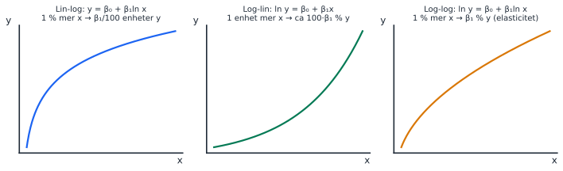
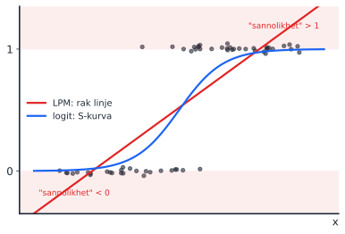
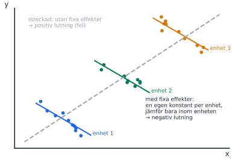
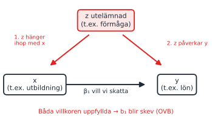

Sista passet före tentan (3 nov). Här ligger de två stora essäfrågorna som var mest urskiljande på alla tre tentatillfällen VT26: linjär sannolikhetsmodell och tolkning av en regressionstabell med fixa effekter. Det är fler uppgifter än det hinns med. Prioritera essäerna och låt de korta frågorna bli hemuppgift.

::: {.pass-meta}
| Föreläsning | Datum | Tema | Kapitel (5:e uppl.) | Teman enligt kursplanen |
|---|---|---|---|---|
| F9 | ons 21 okt | Logaritmiska modeller | 16.4 | Regressionsmodeller med logaritmer |
| F10 | tors 22 okt | (tema ej angivet i planen) | – | |
| F11 | fre 23 okt | Interaktionsvariabler | 16.2 | Regressionsmodeller med interaktionstermer |
| F12 | mån 26 okt (samma dag) | Modeller för sannolikheter; paneldata | 17.1–17.2; paneldata ej i boken | Linjära sannolikhetsmodellen och logistisk regression; introduktion till paneldata |
:::

I VT26 handlade Lecture 12 om omitted variable bias och paneldata. Bilden om utelämnade variabler nedan hör dit.

## Körschema

::: {.korschema}
| Tid | Vad | Kommentar |
|---|---|---|
| 13:00–13:10 | Tavla: tabellen med de tre logmodellerna och LPM mot S-kurvan | |
| 13:10–13:55 | Del 1: uppgift 4 och 8 (essäerna) först, sedan 1–3 | Säg uttryckligen att 5–7 är för den som hinner. |
| 13:55–14:05 | Paus | |
| 14:05–14:55 | Del 2: genomgång | **4** (LPM, störst gap) → **8** (fixa effekter) → **2** (dummyessä) → **3** (log + interaktion) → 1, 5–7 snabbt. |
| 14:55–15:00 | Avslut inför tentan | Peka på startsidans tabell "Återkommer på varje tenta". |
:::

## Nya begrepp

### F9: logaritmiska modeller

::: {.nytt}
Nytt begrepp: tre logmodeller och deras tolkning

| Modell (bokens namn) | Ekvation | Tolkning av b₁ |
|---|---|---|
| Lin-log (*logarithmic model*) | y = b₀ + b₁ ln x | 1 % mer x → y ändras med **b₁ / 100 enheter** |
| Log-lin (*exponential model*) | ln y = b₀ + b₁x | 1 enhet mer x → y ändras med cirka **100 · b₁ %** |
| Log-log (*power regression model*) | ln y = b₀ + b₁ ln x | 1 % mer x → y ändras med **b₁ %** (elasticitet) |

Minnesregel: **ln framför x betyder "procent i x", ln framför y betyder "procent i y".**
:::

::: {.tavla}
Rita på tavlan: tabellen och tre kurvor

{width=100%}

Skriv tabellen ovan på tavlan och låt den stå kvar hela passet. Gruppen ska kunna fylla i tolkningskolumnen själv i slutet.
:::

### F11: interaktion

::: {.nytt}
Nytt begrepp: interaktion med en dummy

I y = b₀ + b₁x + b₂d + b₃(x · d) är effekten av x **b₁ för d = 0** och **b₁ + b₃ för d = 1**. Sätt alltid in d = 0 och d = 1 och skriv två ekvationer, som i cykeluppgiften i pass 3. Med ln x i stället för x gäller samma sak, men delat med 100: (b₁ + b₃) / 100 för d = 1.
:::

### F12: sannolikhetsmodeller

::: {.nytt}
Nytt begrepp: linjär sannolikhetsmodell (LPM) och logit

När y är 0 eller 1 blir ŷ en **sannolikhet**. I en LPM skattas den med vanlig OLS, så koefficienterna tolkas som förändring i sannolikhet i **procentenheter**: b = 0,047 betyder 4,7 procentenheter.

Nackdelar med LPM: prediktioner kan hamna under 0 eller över 1, marginaleffekten är konstant och feltermen är heteroskedastisk. Logit (eller probit) ger en S-kurva som alltid håller sig mellan 0 och 1, men då beror marginaleffekten på var man befinner sig, och R² går inte att använda.
:::

::: {.tavla}
Rita på tavlan: rak linje mot S-kurva

{width=80%}

1. Rita punkter på två vågräta rader, y = 0 och y = 1.
2. Dra en rak linje genom dem (LPM) och visa var den går under 0 och över 1.
3. Rita S-kurvan (logit) som planar ut vid 0 och 1.
4. Fråga: "Var är effekten av x störst på S-kurvan?" (I mitten, där kurvan är brantast.)
:::

::: {.fraga-gruppen}
Fråga till gruppen: procent eller procentenheter?

"En LPM-koefficient är −0,01. Minskar sannolikheten med 1 procent?" Nej, med **1 procentenhet**. Exakt den skillnaden avgjorde 2025-08-20, fråga 4, där den bästa A-tentan svarade fel.
:::

### F12: paneldata och fixa effekter

::: {.nytt}
Nytt begrepp: fixa effekter

Paneldata = samma enheter (skolor, företag, personer) observerade flera gånger. Med **fixa effekter** får varje enhet en egen konstant, ungefär en dummy per enhet. Då försvinner allt som skiljer enheterna åt men inte ändras över tid, och effekten skattas bara utifrån variation **inom** samma enhet.
:::

::: {.tavla}
Rita på tavlan: tre grupper, två slutsatser

{width=80%}

Rita tre punktmoln som vart och ett lutar nedåt men ligger på en stigande diagonal. En linje genom allt (streckad) lutar uppåt. Med fixa effekter jämför man bara inom varje moln och ser det verkliga negativa sambandet.
:::

::: {.tavla}
Rita på tavlan: utelämnad variabel (OVB)

{width=70%}

OVB uppstår när en utelämnad variabel z både hänger ihop med x **och** påverkar y. Fixa effekter tar bort de z som är konstanta inom en enhet, men inte allt. Det är kärnan i uppgift 8c.
:::

## Tentafrågor (uppgiftsbladet)

::: {.tenta}
### 1. Tolka en lin-log-modell
[2026-08-20, fråga 3]{.chip .datum} [2 p]{.chip} [Sant/falskt]{.chip} [80 %]{.chip .latt}

> I en lin–log-modell, om koefficienten på ln(x) skattas till 0,5, innebär det att en ökning av X med 1 procent ökar Y med ungefär 0,005 enheter.

::: {.callout-tip collapse="true" appearance="simple"}
## Facit och genomgång
**Sant.** b₁ / 100 = 0,5 / 100 = 0,005 enheter. Peka på första raden i tabellen.
:::
:::

::: {.tenta}
### 2. Dummyvariabler: begrepp och fällor
[2026-08-20, fråga 17]{.chip .datum} [10 p]{.chip} [🔥 Begreppsfälla: 59 %, gap 3,93]{.chip .disc}

> Ibland används något vi kallar för "dummy-variabler" inom regressionsanalysen. a) Beskriv vad som skiljer en dummyvariabel från de "vanliga variablerna" vi annars använder. Beskriv här själva variabelns egenskaper, inte tolkning av regressionsresultat eller liknande (4p) b) Beskriv vad som skiljer i tolkningen av koefficienten för en dummy-variabel jämfört med de "vanliga variablerna" vi annars använder. (4p) c) Inom regressionsanalysen finns något vi kallar för "the dummy variable trap". Beskriv hur vi kan undvika den. (2p)

::: {.callout-tip collapse="true" appearance="simple"}
## Facit och genomgång
a) Antar bara värdena 0 och 1 och anger tillhörighet till en kategori (t.ex. kvinna/inte kvinna). Den har ingen meningsfull enhet eller skala. En kategorisk variabel med k kategorier görs om till k − 1 sådana variabler.

b) Vanlig variabel: förändring i y per **en enhet** mer x (lutning). Dummy: **skillnaden i genomsnittligt y** mellan gruppen med 1 och referensgruppen, allt annat lika (skillnad i nivå). Nämn referensgruppen uttryckligen, det ger poäng.

c) Ta med k − 1 dummies för k kategorier. Annars summerar de till 1, precis som konstanten, och det blir perfekt multikollinjäritet.

Tips: frågan ger mycket poäng för exakta formuleringar. Låt studenterna skriva sina svar och läs upp ett par. Gruppen bedömer om "referensgrupp" och "allt annat lika" finns med.
:::
:::

::: {.tenta}
### 3. Log-modell med interaktion
[2024-12-15, fråga 5]{.chip .datum} [2025-08-20, fråga 8]{.chip .datum} [4 p]{.chip} [🔁 Tre tentor i rad]{.chip .ofta}

> Suppose you have the following estimated interaction model: ŷ = b₀ + b₁ln(x) + b₂d + b₃ln(x) × d, where ln(x) is the natural logarithm of x and d is a dummy variable. What is the effect of a percent increase in x on the expected dependent variable for d = 1?

- b₃/100
- b₁/100
- (b₁ + b₃d)/100
- b₁ + b₃d
- b₃
- b₁
- b₁ + b₂
- (b₁ + b₃)/100
- b₃/100
- b₁ + b₂ + b₃

::: {.callout-tip collapse="true" appearance="simple"}
## Facit och genomgång
**(b₁ + b₃)/100.** Sätt in d = 1: ŷ = (b₀ + b₂) + (b₁ + b₃) ln(x). Det är en lin-log-modell med koefficienten b₁ + b₃, alltså delat med 100.

Fällan: (b₁ + b₃d)/100 är rätt bara när d **inte** är given (2024-11-01, fråga 5). 2025-08-20 valde den bästa A-tentan just det alternativet och fick 0 poäng. Läs om d är angiven.
:::
:::

::: {.tenta}
### 4. Linjär sannolikhetsmodell: tidsbegränsade anställningar
[2026-08-20, fråga 14]{.chip .datum} [15 p]{.chip} [🔥 Störst gap på tentan: 4,94]{.chip .disc} [🔁 På varje tenta]{.chip .ofta}

> Tidsbegränsade anställningar är en återkommande fråga i arbetsmarknadsdebatten. […] En forskare vill undersöka vilka individer som har högre sannolikhet att ha en tidsbegränsad anställning. Den beroende variabeln är tidsbegränsad (Begr.), som är lika med 1 om individen har en tidsbegränsad anställning och lika med 0 om individen har en tillsvidareanställning. De förklarande variablerna är: kvinna (1 om kvinna), Utb. (antal utbildningsår), ålder, ålder2 (ålder i kvadrat), offentlig (1 om offentlig sektor, 0 om privat), kvinna_offentlig (interaktion mellan kvinna och offentlig sektor).
>
> Begrᵢ = β₀ + β₁Utbᵢ + β₂ålderᵢ + β₃ålder2ᵢ + β₄kvinnaᵢ + β₅offentligᵢ + β₆kvinnaᵢ·offentligᵢ + uᵢ

N = 18 542, R² = 0,1305, justerat R² = 0,1302, F = 463,31 (signifikans F 0,0000).

| | Koefficienter | Standardfel | t-värde | p-värde |
|---|---|---|---|---|
| Intercept | 0,7420 | 0,0300 | 24,7333 | 0,0000 |
| utbildning | −0,0072 | 0,0010 | −7,2000 | 0,0000 |
| ålder | −0,0155 | 0,0011 | −14,0909 | 0,0000 |
| ålder2 | 0,0002 | 0,0000 | 16,0000 | 0,0000 |
| kvinna | 0,0100 | 0,0070 | 1,4286 | 0,1532 |
| offentlig | 0,0250 | 0,0065 | 3,8462 | 0,0001 |
| kvinna_offentlig | 0,0350 | 0,0105 | 3,3333 | 0,0009 |

> Fråga 1 (4 poäng): Predikera sannolikheten att ha en tidsbegränsad anställning för en kvinna som är 30 år gammal, har 14 års utbildning och arbetar i offentlig sektor. Fråga 2 (4 poäng): Vad är den marginella effekten av ålder på sannolikheten att ha en tidsbegränsad anställning för en person som är 60 år gammal? Ge en tolkning också i ord vad det siffran betyder. Fråga 3 (4 poäng): Tolka koefficienterna för kvinna, offentlig och kvinna_offentlig. Fråga 4 (3 poäng): Anta att forskaren funderar på att i stället skatta en logistisk regressionsmodell. Vilken är en viktig nackdel med den linjära sannolikhetsmodellen i detta sammanhang?

::: {.callout-tip collapse="true" appearance="simple"}
## Facit och genomgång
**Fråga 1.** 0,7420 − 0,0072·14 − 0,0155·30 + 0,0002·900 + 0,0100 + 0,0250 + 0,0350 = 0,7420 − 0,1008 − 0,4650 + 0,1800 + 0,0700 = **0,4262 ≈ 42,6 %**. Vanliga fel: glömma interaktionen, eller sätta in 30 i stället för 900 för ålder2.

**Fråga 2.** −0,0155 + 2 · 0,0002 · 60 = **0,0085**: vid 60 år ökar sannolikheten med cirka 0,85 **procentenheter** per extra år. Linjärtermen är negativ men marginaleffekten positiv vid 60. Sambandet är U-format med vändpunkt vid 0,0155 / 0,0004 ≈ 39 år (samma formel som i pass 4).

**Fråga 3.** kvinna (0,0100, p = 0,15): ingen säkerställd skillnad mellan kvinnor och män i **privat** sektor. offentlig (0,0250): män i offentlig sektor har 2,5 procentenheter högre sannolikhet än män i privat. kvinna_offentlig (0,0350): skillnaden mellan kvinnor och män är 3,5 procentenheter större i offentlig sektor. Total skillnad för en kvinna i offentlig sektor mot en man i privat: 0,0100 + 0,0250 + 0,0350 = 7 procentenheter.

**Fråga 4.** LPM kan ge predikterade sannolikheter under 0 eller över 1, och marginaleffekten är konstant. Logit håller sig alltid mellan 0 och 1.

Genomgångstips: ta fråga 1 tillsammans på tavlan rad för rad. Det är den del alla kan få poäng på.
:::
:::

::: {.tenta}
### 5. Linjär sannolikhetsmodell eller probit?
[2026-08-20, fråga 8]{.chip .datum} [4 p]{.chip} [⚠️ Svårt för alla: 55 %, gap 0,30]{.chip .svar}

> En forskare vill studera sannolikheten att en individ stödjer ett förslag om höjd bensinskatt. Den beroende variabeln är lika med 1 om individen stödjer förslaget och 0 annars. Forskaren överväger att använda antingen en linjär sannolikhetsmodell eller en probitmodell. Vilket av följande påståenden är korrekt?

- I en probitmodell kan koefficienterna tolkas direkt som förändringar i sannolikhet.
- En linjär sannolikhetsmodell och en probitmodell ger samma predikterade sannolikheter.
- I en probitmodell bestäms sannolikheten av en icke-linjär funktion, vilket gör att marginaleffekten av en variabel också beror på värdet på variabeln.
- En linjär sannolikhetsmodell garanterar alltid att predikterade sannolikheter ligger mellan 0 och 1.
- En probitmodell kan bara användas om den beroende variabeln är kontinuerlig.

::: {.callout-tip collapse="true" appearance="simple"}
## Facit och genomgång
**Alternativ 3.** Peka på S-kurvan: lutningen ändras längs kurvan. Probit och logit beter sig likadant här. Kursen visar logit, men frågan använde probit, så säg det högt.
:::
:::

::: {.tenta}
### 6. R² och logistisk regression
[2024-12-15, fråga 4]{.chip .datum} [2025-06-05, fråga 3]{.chip .datum} [2024-03-19, fråga 4]{.chip .datum} [2 + 2 p]{.chip} [🔁 Tre tentor]{.chip .ofta}

> a) Is the following statement true or false?: "The R-squared cannot be used with the logistic regression"
>
> b) Is the following statement true or false?: "We cannot evaluate the predictive accuracy of the logistic regression models using adjusted R-squared"

::: {.callout-tip collapse="true" appearance="simple"}
## Facit och genomgång
**a) True. b) True.** Logit skattas inte med OLS och y är 0/1, så SST = SSR + SSE gäller inte. Man jämför i stället andelen rätt klassificerade observationer. 2024-03-19 frågade samma sak om "binary choice models".
:::
:::

::: {.tenta}
### 7. Fixa effekter
[2026-08-20, fråga 4]{.chip .datum} [2 p]{.chip} [Sant/falskt]{.chip} [Lätt: 78 %]{.chip .latt}

> Fixa effekter innebär att vi kontrollerar för tidsinvarianta skillnader mellan enheter, till exempel individer, kommuner eller företag. I en paneldatamodell identifieras effekten då av variation inom samma enhet över tid.

::: {.callout-tip collapse="true" appearance="simple"}
## Facit och genomgång
**Sant.** Bra uppvärmning före uppgift 8. Peka på bilden med de tre molnen.
:::
:::

::: {.tenta}
### 8. Diskriminering i skolan: fixa effekter och kausal diskussion
[2026-08-20, fråga 13]{.chip .datum} [15 p]{.chip} [🔥 Begreppsfälla: 43 %, gap 3,99]{.chip .disc}

> I artikeln "Gender Grading Bias in Junior High School Mathematics" […] undersöker vi om pojkar missgynnas vid betygssättning i matematik i grundskolans senare år i Stockholm under perioden 2012–2017. Vi gör detta genom att jämföra elevernas slutbetyg i matematik från grundskolan, nedan kallat Betyg, med resultatet på ett diagnostiskt prov i matematik, nedan kallat Provresultat. […] Provet genomförs under den första veckan på gymnasiet, ungefär två månader efter att slutbetyget i matematik sattes i grundskolan. Både betyg och provresultat är normaliserade till samma skala, från 0,0 till 2,0 […]. Den beroende variabeln Y i analysen är skillnaden mellan betyg och provresultat: Yᵢ = Betygᵢ − Provresultatᵢ […]. Vi estimerar följande modell: Yᵢ = β₀ + β₁Pojkeᵢ + β₂X + uᵢ. […] Klustrade standardfel anges inom parentes. […] * anger signifikans på 10 %-nivån, ** på 5 %-nivån och *** på 1 %-nivån.

| Variabel | (1) | (2) | (3) | (4) | (5) | (6) |
|---|---|---|---|---|---|---|
| Pojke | −0,232*** (0,007) | −0,233*** (0,007) | −0,237*** (0,007) | −0,238*** (0,009) | −0,239*** (0,010) | −0,238*** (0,011) |
| Andel kvinnliga lärare | | | | 0,255 (0,137) | | 0,045 (0,180) |
| Föräldrars utbildningsnivå | | | | | 0,115 (0,099) | 0,133 (0,099) |
| Andel pojkar | | | | | 0,118 (0,110) | 0,127 (0,100) |
| Års-FE | Nej | Ja | Ja | Ja | Ja | Ja |
| Skol-FE | Nej | Nej | Ja | Ja | Ja | Ja |
| N | 33 486 | 33 486 | 33 486 | 33 486 | 33 486 | 33 486 |
| Justerat R² | 0,036 | 0,044 | 0,114 | 0,102 | 0,110 | 0,110 |

> a) Regressionsmodell (2 poäng): Skriv upp den skattade regressionsfunktionen som motsvarar den sista kolumnen, kolumn (6), i tabellen. Du behöver inte inkludera konstanten i ditt svar eller de fixa effekterna. b) Tolkning av koefficienter (5 poäng): Tolka och kommentera samtliga skattade koefficienter i kolumn (6). c) Tolkning och kausal diskussion (8 poäng): Använd informationen i tabellen och introduktionen ovan för att diskutera om resultaten stödjer slutsatsen att pojkar diskrimineras vid betygssättning i matematik. Kan du komma på en alternativ förklaring till de skattade resultaten som inte bygger på betygsdiskriminering?

::: {.callout-tip collapse="true" appearance="simple"}
## Facit och genomgång
**a)** Ŷ = −0,238·Pojke + 0,045·Andel kvinnliga lärare + 0,133·Föräldrars utbildningsnivå + 0,127·Andel pojkar.

**b)** Pojke: skillnaden mellan betyg och provresultat är i genomsnitt 0,238 enheter mindre för pojkar än för flickor, jämfört inom samma skola och år. Pojkar får alltså lägre betyg i förhållande till vad provet visar (skalan är 0–2, så det är en stor skillnad). Signifikant på 1 %. De tre kontrollvariablerna är inte signifikanta (t = koefficient / standardfel < 2). Skol-FE och Års-FE: jämförelsen görs inom samma skola och samma år.

**c)** Stöd: koefficienten är nästan densamma (−0,232 till −0,239) i alla sex kolumner. Den påverkas alltså inte av fixa effekter eller kontroller, vilket talar emot att skillnader mellan skolor förklarar resultatet.

Alternativa förklaringar: (1) betyget mäter mer än provet, t.ex. närvaro, inlämningar och muntlig aktivitet, där flickor i genomsnitt kan ligga högre. (2) Provet skrivs två månader senare och påverkar ingenting. Om flickor i genomsnitt anstränger sig *mindre* än pojkar på ett sådant prov blir flickornas provresultat lägre och deras Y högre, och skillnaden uppstår utan diskriminering. Kontrollera riktningen med gruppen: om pojkar i stället ansträngde sig mindre skulle pojkarnas Y bli *högre*, vilket är tvärtom mot resultatet. Detta är OVB-resonemanget: något som hänger ihop med kön och påverkar Y.

Genomgångstips: det här var en av de svagaste frågorna. Låt grupperna först bara svara på a) och tolka **en** koefficient, sedan diskutera c) muntligt två och två.
:::
:::

## Fler tentafrågor på området

::: {.fler}
| Tenta | Fråga | Rätt svar | Kommentar |
|---|---|---|---|
| 2024-03-19, fråga 8 | "A model in which only one or more independent variables is log transformed is called a(n) …" | logarithmic model | Bokens namn. |
| 2024-11-01, fråga 8 | "… only the dependent variable is log transformed …" | exponential model | |
| 2024-12-15, fråga 8 | "… both the dependent and independent variables are log transformed …" | power regression model | Inte "log-log model" bland alternativen. |
| 2024-11-01, fråga 4 | "The models with log transformations cannot be estimated with the ordinary least squares method" | False | |
| 2025-03-25, fråga 7 | Log-log, β₁ = 0,8. Vad händer med y om x ökar med 5 %? | Y increases by 4% | 0,8 · 5 %. |
| 2025-08-20, fråga 7 | Log-log, β₁ = 0,2. x ökar med 1 % | Y increases by 0.2% | |
| 2025-06-05, fråga 10 | ln y = β₀ + β₁x, β₁ = 0,04, x ökar med 5 enheter | 20% | 100 · 0,04 · 5. |
| 2024-11-01, fråga 5 | Samma log-interaktion som uppgift 3 men utan givet d | (b₁ + b₃d)/100 | Jämför med uppgift 3. |
| 2025-03-25, fråga 8 | y = β₀ + β₁x + β₂d + β₃xd + ε, β₃ < 0. Vad innebär det? | The effect of x on y is weaker when d = 1 | |
| 2025-06-05, fråga 11 | y = β₀ + β₁x + β₂xd + ε. Interaktionen orsakar … | a change in just the slope | Ingen dummy-huvudeffekt, alltså samma intercept. |
| 2026-08-20, fråga 7 | Y = b₀ + b₁X + b₂Kvinna + b₃(X·Kvinna) + e. Vilket påstående är korrekt? | Inget av ovanstående | ⚠️ Svårt för alla: 37 %. Effekten av X är b₁ för män och b₁ + b₃ för kvinnor, vilket inget alternativ säger. |
| 2026-08-20, fråga 5 | LPM, dummy för högst grundskola, b = 0,047 | 4,7 **procentenheter** högre sannolikhet att vara arbetslös | 80 %. |
| 2025-03-25, fråga 4 | Logit, marginaleffekt −0,015: "reduces the probability by 1.5 percentage point" | True | |
| 2025-08-20, fråga 4 | Marginaleffekt −0,01: "reduces the probability of the event by 1%" | False | Procent mot procentenheter. Den bästa A-tentan svarade fel. |
| Engelska essäfrågan 14 2024–2025 | LPM: predicera sannolikhet, marginaleffekt av ålder, tolka dummy och ln(inkomst) | | Samma färdigheter som uppgift 4. ln(inkomst) i en LPM: 1 % mer inkomst ger b / 100 procentenheter. |
:::

## Interaktivt (visa från datorn)

LPM mot logit: flytta reglagen och se var LPM-linjen lämnar intervallet [0, 1].

```{ojs}
//| echo: false
viewof l_a = Inputs.range([-8, 2], {step: 0.1, value: -5.5, label: "logit: konstant"})
viewof l_b = Inputs.range([0.2, 2.5], {step: 0.05, value: 1.1, label: "logit: lutning"})
l_pts = {
  const rand = d3.randomUniform.source(d3.randomLcg(7));
  return d3.range(80).map(() => {
    const x = 10 * rand()();
    const p = 1 / (1 + Math.exp(-(l_a + l_b * x)));
    return {x, y: rand()() < p ? 1 : 0};
  });
}
l_ols = {
  const mx = d3.mean(l_pts, d => d.x), my = d3.mean(l_pts, d => d.y);
  const b = d3.sum(l_pts, d => (d.x - mx) * (d.y - my)) / d3.sum(l_pts, d => (d.x - mx) ** 2);
  return {a: my - b * mx, b};
}
md`LPM (OLS på samma data): ŷ = ${l_ols.a.toFixed(2)} + ${l_ols.b.toFixed(3)}x. Konstant marginaleffekt **${(100 * l_ols.b).toFixed(1)} procentenheter** per enhet x. Logitens marginaleffekt beror på x och är störst där p = 0,5.`
Plot.plot({
  width: 640, height: 340, x: {domain: [-1, 11], label: "x"}, y: {domain: [-0.4, 1.4], label: "sannolikhet"},
  marks: [
    Plot.rect([{x1: -1, x2: 11, y1: 1, y2: 1.4}, {x1: -1, x2: 11, y1: -0.4, y2: 0}], {x1: "x1", x2: "x2", y1: "y1", y2: "y2", fill: "#fde8e8"}),
    Plot.dot(l_pts, {x: "x", y: "y", r: 3, fill: "#1f2a37", fillOpacity: 0.5}),
    Plot.line([[-1, l_ols.a - l_ols.b], [11, l_ols.a + 11 * l_ols.b]], {stroke: "#e02424", strokeWidth: 2.5}),
    Plot.line(d3.range(-1, 11.01, 0.1).map(x => [x, 1 / (1 + Math.exp(-(l_a + l_b * x)))]), {stroke: "#1c64f2", strokeWidth: 2.5})
  ]
})
```

Logtolkning: räkna ut effekten för valfri modell.

```{ojs}
//| echo: false
viewof lm_typ = Inputs.radio(["lin-log", "log-lin", "log-log"], {value: "lin-log", label: "modell"})
viewof lm_b = Inputs.number({value: 0.5, step: 0.01, label: "b₁"})
viewof lm_d = Inputs.number({value: 1, step: 1, label: lm_typ === "log-lin" ? "ökning i x (enheter)" : "ökning i x (%)"})
md`${lm_typ === "lin-log" ? `y ändras med cirka **${(lm_b * lm_d / 100).toFixed(4)} enheter** (b₁ · ${lm_d} / 100)` : lm_typ === "log-lin" ? `y ändras med cirka **${(100 * lm_b * lm_d).toFixed(2)} %** (100 · b₁ · ${lm_d})` : `y ändras med cirka **${(lm_b * lm_d).toFixed(2)} %** (b₁ · ${lm_d})`}`
```
